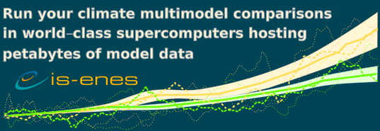
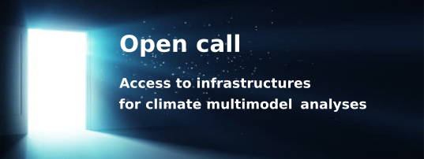

### IS-ENES3 3rd call for an OASIS Dedicated User Support
- open when: **Th, 25. Nov 2021**
- duration: **Nov 25, 2021 10:00 AM to Jan 15, 2022 11:00 AM**

Within IS-ENES3, work-package 6 "Services on European ESMs and Software Tool", a Trans-National Access action, proposes to provide technical help to upgrade the code or enhance computing performance of OASIS3-MCT based coupled models.

This year, a total of 3 person-months of Dedicated User Support will be offered to 3 different groups. Provided by CERFACS, this service is available to any climate research laboratory in Europe. This service excludes the scientific development, tuning, analysis and evaluation of the coupled model components themselves and of the coupled model as a whole. At the moment, difficult traveling conditions forbid to give this service on site. This additional constraint leads to favor short and well-defined tasks that can be achieved remotely.

**Application procedure**

- Briefly describe your project and your needs filling the questionnaire "Description of your OASIS project” (5 pages maximum)
- Send your questionnaire to Eric Maisonnave (eric.maisonnave[at]cerfacs.fr).

The application deadline for this 3rd call is January 15th, 2022.

**Evaluation criteria**

- Conciseness and good definition of the required enhancements or modifications. Developments focused on the OASIS software (instead of model interfaces) will be preferred
- Quality of the methodology proposed
- Expected scientific impact of the target coupled system and its long-term support by the applicant group
- Development of cooperation with communities outside ENES
- Potential training aspects for new or young users
- Synergy with the OASIS3-MCT development plan
- Originality of the problem: e.g. new physics (ice sheets, hydrology, atmosphere/ocean boundary layer, regional modelling, ...), increased task parallelism (extraction and concurrent running of sub-components e.g. sea-ice), etc.

The selection will be made by members of the OASIS Advisory Board. The institutions selected will be notified by the end of February 2022.

*Your personal data (name, surname, e-mail address) will be collected by CERFACS for selecting and maintaining your candidacy. The legal basis of the processing is Article 6 (1) lit. e General Data Protection Regulation (GDPR) . Your data might be shared among ISENES3 partners and will be deleted at the end of the IS-ENES3 project. In accordance with the European GDPR, you can ask for data rectification, data access and data erasure by contacting Eric Maisonnave (eric.maisonnave[at]cerfacs.fr).*

**The results of the OASIS support call will be available in the deliverable D6.4.**

### 5th call for Access to Advanced Analysis Platforms for CMIP6 and CORDEX
- open when: **Tu, 1. Jun 2021**
- duration: **Jun 01, 2021 09:00 AM to Dec 20, 2021 06:00 PM**

Apply for direct access to compute facilities: 

- Discover the model data you are interested in
- Process your multimodel analyses in the supercomputer
- Download the results 

**Deadline: 20th of December 2021 (pre-access test activities are also possible)**

We are broadening access to world-class supercomputers at the national facilities used by research communities in Germany and the UK. These facilities provide access to significant computational resources located next to extensive data collections, including data from CMIP6 and CORDEX.

Thanks to funding from EU H2020, the IS-ENES3 project is able to provide access free of charge to scientists from anywhere in Europe. 

With the new Access to Advanced Analysis Platforms, you will be able to
- log onto a server which has direct access to the filesystem containing the data, we can import additional data on request, 
- run your own software, 
- have access to a large collection of software libraries commonly used to analyse climate model output. 

Calls are open twice a year, approximately every 6 months. Find the application procedure on the [ENES portal](https://portal.enes.org/data/data-metadata-service/analysis-platforms).

### 4th call for Access to Advanced Analysis Platforms for CMIP6 and CORDEX
- open when: **Su, 1. Nov 2020**
- duration: **Nov 01, 2020 12:00 PM to May 31, 2021 01:00 PM**

Apply for direct access to compute facilities: 

- Discover the model data you are interested in
- Process your multimodel analyses in the supercomputer
- Download the results 

**Deadline: 31st of May 2021 (pre-access test activities are also possible)**

We are broadening access to world-class supercomputers at the national facilities used by research communities in Germany, France, Italy and the UK. These facilities provide access to significant computational resources located next to extensive data collections, including data from CMIP6 and CORDEX.

Thanks to funding from EU H2020, the IS-ENES3 project is able to provide access free of charge to scientists from anywhere in Europe. 

With the new Access to Advanced Analysis Platforms, you will be able to
- log onto a server which has direct access to the filesystem containing the data, we can import additional data on request, 
- run your own software, 
- have access to a large collection of software libraries commonly used to analyse climate model output. 

Calls are open twice a year, approximately every 6 months. Find the application procedure on the [ENES portal](https://portal.enes.org/data/data-metadata-service/analysis-platforms).

### 3rd call for Access to Advanced Analysis Platforms for CMIP6 and CORDEX
- open when: **We, 10. Jun 2020**
- duration: **Jun 10, 2020 02:00 PM to Oct 31, 2020 03:00 PM**

Apply for direct access to compute facilities:
- Discover the model data you are interested in
- Process your multimodel analyses in the supercomputer
- Download the results

**Deadline: 31st of October 2020 (pre-access test activities are also possible)**

We are broadening access to world-class supercomputers at the national facilities used by research communities in Germany, France, Italy and the UK. These facilities provide access to significant computational resources located next to extensive data collections, including data from CMIP6 and CORDEX.

Thanks to funding from EU H2020, the IS-ENES3 project is able to provide access free of charge to scientists from anywhere in Europe. 

With the new Access to Advanced Analysis Platforms, you will be able to
- log onto a server which has direct access to the filesystem containing the data, we can import additional data on request
- run your own software, 
- have access to a large collection of software libraries commonly used to analyse climate model output. 
 Calls are open twice a year, approximately every 6 months.

### Second call for Access to Advanced Analysis Platforms for CMIP6 and CORDEX
- open when: **Mo, 16. Dec 2019**
- duration: **Dec 16, 2019 12:00 AM to Jun 10, 2020 12:00 AM**

Apply for direct access to compute facilities:

- Discover the model data you are interested in
- Process your multimodel analyses in the supercomputer
- Download the results

**Deadline: 31st of October 2020 (pre-access test activities are also possible)**

We are broadening access to world-class supercomputers at the national facilities used by research communities in Germany, France, Italy and the UK. These facilities provide access to significant computational resources located next to extensive data collections, including data from CMIP6 and CORDEX.

Thanks to funding from EU H2020, the IS-ENES3 project is able to provide access free of charge to scientists from anywhere in Europe.

With the new Access to Advanced Analysis Platforms, you will be able to
- log onto a server which has direct access to the filesystem containing the data, we can import additional data on request,
- run your own software,
- have access to a large collection of software libraries commonly used to analyse climate model output.

Calls are open twice a year, approximately every 6 months. Find the application procedure on the [ENES portal](https://portal.enes.org/data/data-metadata-service/analysis-platforms).

### 1st call for Analysis Platforms for CMIP6 and CORDEX
- open when: **Mo, 16. Sep 2019**
- duration: **Sep 16, 2019 08:00 AM to Dec 08, 2019 05:00 PM**
- note: Deadline Extended: Dec 15 2019

SUPPORTING THE NEW CMIP6

Apply for virtual workspaces and directly access compute facilities
with locally maintained CMIP and CORDEX data pools

Open on the 16th of September 2019 - Deadline Extended: 15th of December 2019

New data near processing capabilities at the centers DKRZ, CNRS-IPSL, STFC (at CEDA), and CMCC will be made accessible to a broader user community via the new Transnational Access (TNA) service. These processing capabilities support multi-model server-side data analyses through direct access to large data pools including replicated data from the European as well as non-European ESGF data nodes.

Calls are open twice a year, approximately every 6 months. Find the application procedure on the [ENES portal](https://portal.enes.org/data/data-metadata-service/analysis-platforms).

### IS-ENES3 2nd call for an OASIS Dedicated User Support
- open when: **Fr, 6. Sep 2019**
- duration: **Sep 06, 2019 12:00 AM to Oct 31, 2019 12:00 AM**

OASIS Dedicated User Support
*2nd call for applicants - 2020-2021*

[Summary of the 2020-2021 2nd OASIS dedicated support](https://raw.githubusercontent.com/valeriupredoi/isenes3-website-old/main/old-site/files/odus_report_5_geom_ISENES.pdf)

Within IS-ENES3, work package 6 "Services on European ESMs and Software Tool", a transnational access action proposes to provide technical help at user site to design, upgrade or enhance the implementation of the OASIS3-MCT interface in your model(s) and/or set up a tailored and computationally efficient coupled system.

This service excludes the scientific development, tuning, analysis and evaluation of the coupled model components themselves and of the coupled model as a whole.

This year, a total of 3 person-months of Dedicated User Support will be offered to 3 different groups. Provided by CERFACS, this service is available to any climate research laboratory in Europe.

### 1st call for an OASIS Dedicated User Support
- open when: **Tu, 1. Jan 2019**
- duration: **Jan 01, 2019 12:00 AM to Jan 31, 2019 12:00 AM**

OASIS Dedicated User Support
*1st call for applicants - 2019*

[Summary of the 2019 1st OASIS dedicated support](https://raw.githubusercontent.com/valeriupredoi/isenes3-website-old/main/old-site/files/summary_OASIS_dedicated_support_2019.pdf)

Within IS-ENES3, work package 6 "Services on European ESMs and Software Tool", a transnational access action proposes to provide technical help at user site to design, upgrade or enhance the implementation of the OASIS3-MCT interface in your model(s) and/or set up a tailored and computationally efficient coupled system.

This service excludes the scientific development, tuning, analysis and evaluation of the coupled model components themselves and of the coupled model as a whole.

This year, a total of 3 person-months of Dedicated User Support will be offered to 3 different groups. Provided by CERFACS, this service is available to any climate research laboratory in Europe.

