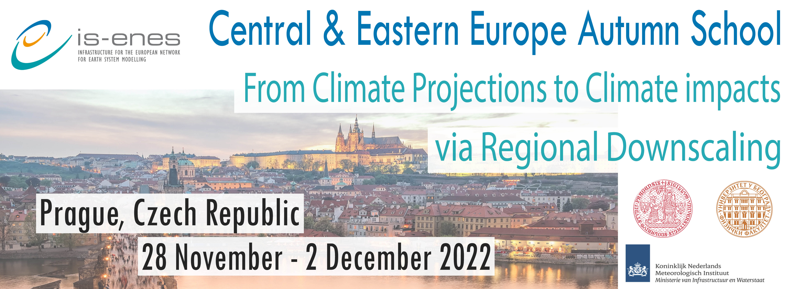

The [Charles University](https://cuni.cz/uken-1.html), Faculty of Mathematics and Physics, Department of Atmospheric Physics, within the project IS-ENES3, with cooperation of [KNMI](https://www.knmi.nl/home) and the [Faculty of Physics of Belgrade](http://www.bg.ac.rs/en/members/faculties/PHY.php), **organises two parallel schools (with common days to CORDEX FPC Convection final General Assembly)** targeted to **climate and impact researchers from Central and Eastern Europe** on **28 November until 2 December 2022 in Prague (Czech Republic)**, [hotel Krystal](https://www.centrum-krystal.cz).

Climate change is one of the biggest challenges in our times. To be able to do climate change impact studies and to adapt to climate change, the understanding of the climate system behaviour - especially in higher resolution considering local conditions - is essential, and knowledge on climate data and experience on processing and analyzing climate data is needed. The main source of future data are climate projections, and we rely on regional downscaling for high resolution information. During the school, climate and impact researchers and students will get lectures on climate models and downscaling methods, on tools to analyze and process climate data and how to apply them for impact studies. This is combined with information where and how to access the necessary data, as well as dedicated time for tutorials and practical exercises in order to get experience with these data and tools.

Since climate and impact researchers/students have different levels of background knowledge about climate, during the first two days the participants get different lectures and tools to work with. Starting the third day, climate and impact researchers/students will work together on an impact study.

Special occasion is given to participants to attend the final meeting with selected presentations of CORDEX FPS Convection (to be held last three days of the schools),  where they can get acquainted with the up-to-date activity in dynamical downscaling in very high resolution, so-called convection permitting access to the modelling, describing convection explicitly without parameterization.

**The aim of the schools is to**:
- get deeper insight on the issue of climate projections and up-to-date directions in downscaling of them for regional and local climate change impacts studies
- get more knowledge about the various types and sources of climate data and tools/methods to analyse/process them and get experience in using these tools/methods/data
- learn what is needed for interdisciplinary impact/adaptation studies on climate change
- create/broaden network on climate change and impact assessments

**Target groups**
- Climate researchers and students (Bachelor, MSc, PhD);
- Impact researchers and students (Bachelor, MSc, PhD) on agriculture/forestry, hydrology/water management and health

Priority will be given to Eastern and Central Europe researchers and students, but candidates from other EU countries can also apply for potential remaining seats.

**Application form**

**Apply before November 7th by filling [this form](https://docs.google.com/forms/d/e/1FAIpQLSftL_ZSPzKLpV87g08IYXMI5iGAgWi46TFADuJG6Zk6bZYONA/viewform?usp=sf_link)** !

**Deadlines**
- Registration deadline: **November 7, 2022.**
- Participants notification on acceptance: November 11, 2022.

**Accommodations, meals and travel**

Accommodation in double rooms and lunches will be covered by the organizers. Travel costs and dinners will be covered by participants.

We aim at having around 20 persons per group (total of 40-50 participants).
The working language during the course will be English.

If you have any questions, please write to: tomas.halenka[a]mff.cuni.cz

**The Central & Eastern Europe Autumn Schools Privacy Policy** is available **[here](https://raw.githubusercontent.com/IS-ENES3/IS-ENES-Website/main/pdf_documents/IS-ENES3_Privacy_Policy-Eastern_Europe_Schools.pdf)**.

