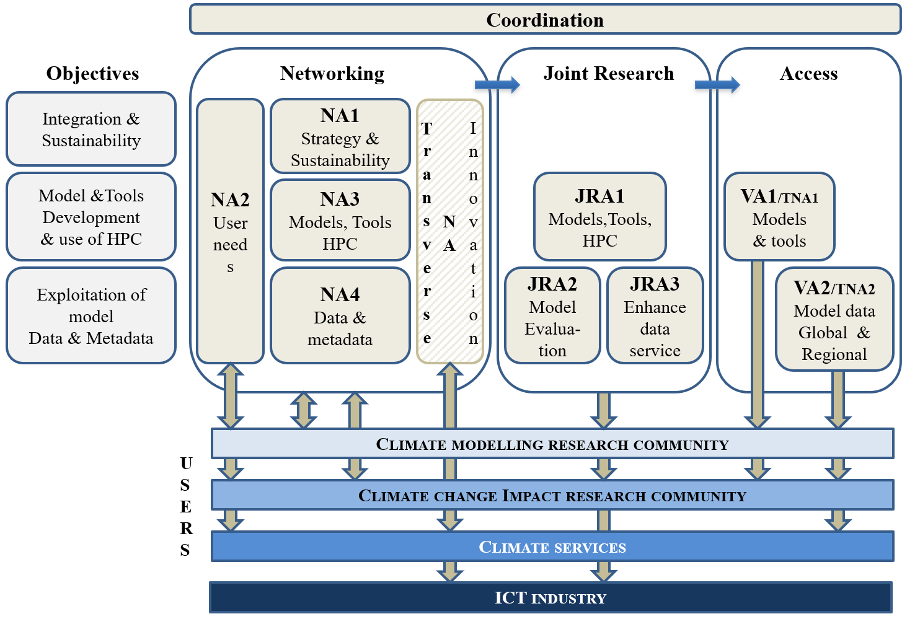

IS-ENES3 is structured into 10 work packages:

- 4 Networking Activities (NA)
- 2 Service Activities (Virtual Access - VA and Trans-national Access -TNA)
- 3 Joint Research Activities (JRA) 
- One work package dedicated to the project coordination & management 
- One virtual work package is dedicated to Innovation

*Here is a schematic representation of IS-ENES3 objectives and organisation of work packages:*

### List of IS-ENES3 Work Packages:

#### [WP1: Coordination, dissemination and management of IS-ENES3](https://is-enes3.github.io/IS-ENES-Website/wp1)

This work package will ensure an effective, smooth and high-quality implementation of the project, with respect to both general administrative and management practices that are expected for projects funded via the EC programmes, and with respect to financial management.

**Networking activities:**

#### [NA1 (WP2): Governance, Sustainability and Innovation](https://is-enes3.github.io/IS-ENES-Website/wp2)

This work package addresses the objective for IS-ENES3 to pursue integration of the community and prepare for sustainability through relationships with stakeholder partners and governance and leading the IS-ENES3 strategy on innovation.

#### [NA2 (WP3): Community Engagement](https://is-enes3.github.io/IS-ENES-Website/wp3)

This work package aims at further engaging with the community of users of IS-ENES services, by widening the user base through training, engaging the community in co-constructing standards and expressing needs, and engaging the younger generation in interdisciplinary approaches.

#### [NA3 (WP4): Networking on Models, Tools and efficient use of HPC](https://is-enes3.github.io/IS-ENES-Website/wp4)

This networking work package will ensure that the partners develop European models and tool in a sustainable way for the benefit of as wide a community as possible based on user requirements.

#### [NA4 (WP5): Networking on data and model evaluation](https://is-enes3.github.io/IS-ENES-Website/wp5)

This work package aims at identifying and, when possible, defining connections around the data, metadata and “data centric compute” activities in Europe and worldwide in order to foster the dissemination of data and information of all kinds relevant for the climate research community.

**Service activities**

#### [VA1 (WP6): Services on European ESMs and Software Tools](https://is-enes3.github.io/IS-ENES-Website/wp6)

This work package, building on previous work and structures established in the past two phase of IS-ENES, will further maintain, extend, and improve services around the main European ESMs, and the NEMO ocean model, and their respective development and user communities.

#### [VA2 (WP7): Data standards, distribution and processing services](https://is-enes3.github.io/IS-ENES-Website/wp7)

The work package will provide operational support to the climate and climate impact research communities and other communities using the data and tooling provided by IS-ENES3.

**Joint research activities**

#### [JRA1 (WP8): Models & Tools developments](https://is-enes3.github.io/IS-ENES-Website/wp8)

The work package will further develop community models and tools with the development of a unified European platform for Sea Ice to be implemented within NEMO, and with the identification and development of additional community tools, i.e. XIOS for data flow management and Cylc/Rose for the automation of suites of tasks.

#### [JRA2 (WP9): Earth System Model Evaluation developments](https://is-enes3.github.io/IS-ENES-Website/wp9)

The work package aims at further developing the Earth System Model Evaluation Tool ([ESMValTool](https://www.esmvaltool.org/)), a community-development that aims at facilitating model evaluation within CMIP and at individual modelling centres.

#### [JRA3 (WP10): Climate Data Infrastructure software stack developments](https://is-enes3.github.io/IS-ENES-Website/wp10)

Driven by requirements and needs gathered by WP5/NA4, this work package activities will provide sustainable, streamlined, and scalable foundation for the climate data infrastructure software stack that will be run in production in WP7/VA2.
