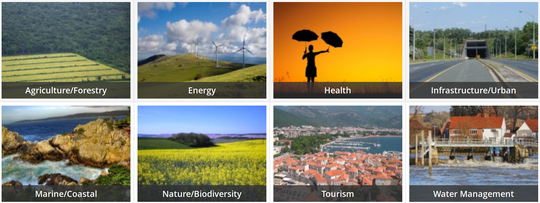

**The [Climate4Impact portal](www.climate4impact.eu) is a user interface and a collection of services dedicated to climate change impact modellers, impact and adaptation consultants, and other experts using climate change data.**

Bridging the gap from global and regional climate model data to impact models input data

- Access to data, also remotely (no need for data download or software installation)
- Quick looks of Global and Regional Climate models, as well as some downscaled higher resolution climate data
- Data transformation and processing tools, including mapping and plotting capabilities
- How-To documentation and contact an expert services
- Use cases and examples in several impact and adaptation themes

