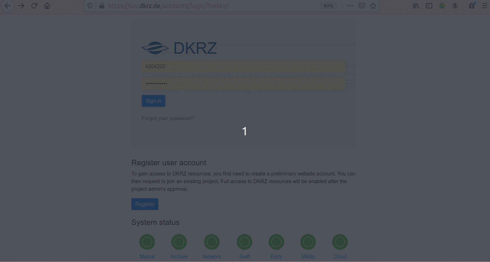

The ENES Climate Analytics Service (ECAS) provides free of charge access to server-side near-data processing capabilities through four different installations hosted at [DKRZ](https://www.dkrz.de/de), [CMCC](https://www.cmcc.it/), [CNRS-IPSL](https://www.ipsl.fr/en/) and [UKRI](https://www.ukri.org/)-[CEDA](https://www.ceda.ac.uk/) premises, which offer a virtual climate research environment for Jupyter notebooks and parallel back-end compute capabilities.

| **News! Find the link to the scripts and the recordings of the demos in the page of our [last online training](https://is-enes3.github.io/IS-ENES-Website/workshops-detailed#compute-analytics).** |

The ECAS integrates data and tools for scientific data analysis, manipulation and visualization, offering access to CMIP5, CMIP6 as well as CORDEX datasets from ESGF. Look at the benefits:

- **Compute-to-data: no more heavy data transfer**
- **Universal availability: log in wherever you are and no need to back up**
- **Parallel processing: to compute faster** 

You just need internet access to log in, there is nothing to install, we make the data, the software, and the hardware ready for you!

The ECAS is a service with institutional-based deployments addressing national requirements and needs with four instances: DKRZ, CMCC, IPSL and UKRI/CEDA, which represent different technical implementations (or *flavours*). Find below a short description about the four ENES climate analytics service facilities at:
- **[DKRZ](#cas-dkrz)**
- **[CMCC](#cas-cmcc)**
- **[UKRI/CEDA](#cas-ukri)**
- **[CNRS-IPSL](#cas-ipsl)**

Visit the service FAQs [PAGE TO BE CREATED] and find our contact and the link to use cases.

**Important note**: unfortunately we cannot offer unlimited resources. The ECAS only provides computer resources for pre- and post-processing (not suitable for simulation runs) in shared computing nodes. If you would like to use exclusive extensive resources, please apply to our [Analysis Platforms service](https://is-enes3.github.io/IS-ENES-Website/sdm-analysis-platforms-service). 

Find training material and useful scripts [here](https://github.com/IS-ENES-Data/Climate-data-analysis-service) and the list of recorded videos of the demos in the IS-ENES3 Youtube channel [here](https://www.youtube.com/playlist?list=PLFvev1W5vG7P1VGITP3ys1GpXnhL--jIc).

###  ENES Climate Analytics Service at DKRZ
 
The ECAS at DKRZ is a free of charge server-side data-near processing service based on Jupyter notebooks (where Python is promoted, but you can also use R and Julia) to directly load and process CMIP and other climate data. The DKRZ ECAS is hosted at the [DKRZ Jupyterhub](https://jupyterhub.dkrz.de), which offers:
- support for fast computations provided via the [Xarray](https://xarray.pydata.org/en/stable/) Python package for labelled multi-dimensional arrays, which is particularly tailored to working with [NetCDF](https://www.unidata.ucar.edu/software/netcdf/) files, and integrates tightly with [Dask](https://www.dask.org/) for parallel computing, and
- direct access to the [CMIP data pool](https://docs.dkrz.de/doc/index.html), that we update and maintain, because DKRZ is an ESGF data node, and it is easily accessible via the [Intake](https://intake.readthedocs.io/en/latest/) Python package.
- support for [ESMValTool](https://www.esmvaltool.org/) - a community diagnostic and performance metrics tool for routine evaluation of Earth system models in CMIP. Please have a look at the [example notebooks](https://github.com/ESMValGroup/ESMValTool-JupyterLab). 
Visit our [use cases repository](https://github.com/IS-ENES-Data/Climate-data-analysis-service) where we demonstrate how to use ECAS resources. There is for instance the Jupyter notebook of the Summer Days Climate Index calculation with CMIP6 using Intake and Xarray that we introduce in the following 4 steps Quick Start (click on the images to enlarge them):

1. Get a DKRZ account [here](https://luv.dkrz.de/accounts/login/?next=/):

Once you submit the form in less than one day you will get an email from us with your user name

2. Log in [here](https://luv.dkrz.de/accounts/login/?next=/) and requet to join the 1088 project:

Please, add in the description the mandatory items we indicate [below](#mandatory)

3. Log in to the Jupyterhub [here](https://jupyterhub.dkrz.de/hub/login?next=%2Fhub%2Fhome) and open your notebook:

choose a job profile depending on how much computing power and memory you need. Choose a "prepost" one if your notebook requires internet connection. "Account" stands for the project you joined, i.e. "bk1088"

4. Directly load and use the data on your notebook

**Mandatory items to add in the description (step 2 in the Quick Start above)**: when you request to join project 1088, please specify the following:
1. "I apply to be a user of the ENES Climate Analysis Service (ECAS)".
2. Summarize your activity including your affiliation, the data you need and what for, and the impact of the results (no more than 3 sentences): "I work at (your institution) in (the country your work) for (your project). I would like to use (the data you need) to calculate (your pre- or post-processing analysis). My results will be part of (publications, reports,...) and be presented at (conferences, seminars,...)" .
3. Tell us the duration of your access. By default you can use the service during 1 month and it is extendible on demand, up to 3 months. Reapplication is possible. If you would like to use DKRZ resources for longer time, please apply to our Analysis Platforms service.

It will take us about one day to evaluate this info. If everything is ok, we will send you a confirmation email and you can start using the service (see step 3 above)!

For questions about the DKRZ ECAS, please reach us at <data-pool@dkrz.de>. Visit our FAQs [INTERNAL LINK] here.

###  ENES Climate Analytics Service at CMCC

The CMCC climate analytics service instance is accessible at [https://ecaslab.cmcc.it/](https://ecaslab.cmcc.it/web/home.html) and provides:
- support for fast computations through the [Ophidia data analytics framework](https://ophidia.cmcc.it/), which enables data-intensive analysis exploiting advanced parallel computing techniques and smart data distribution methods;
- a large set of pre-installed Python libraries for data manipulation, processing and visualization ([Xarray](https://xarray.pydata.org/en/stable/), [Pandas](https://pandas.pydata.org/), [Matplotlib](https://matplotlib.org/), [Cartopy](https://scitools.org.uk/cartopy/docs/latest/), etc.);
- a data publication service to provide catalog, metadata, and access services for scientific data;
- variable-centric CMIP data archive synchronised with ESGF catalog.
Free registration is required. Get your account [here](https://ecaslab.cmcc.it/web/registration.php).

The Ophidia framework documentation, including starter tutorials, descriptions of all processing operators and example workflows, is available [here](https://ophidia.cmcc.it/documentation/).

For questions about the CMCC ECAS, please reach us at ecas-support(at)cmcc(dot)it. Visit our FAQs here.

###  ENES Climate Analytics Service at UKRI-CEDA

The UKRI-CEDA climate analytics service is accessible through the Jupyter Notebook service on the JASMIN data analysis platform. Step by step instructions on how to register for a JASMIN account and request access to the Notebook Service are available at [https://help.jasmin.ac.uk/article/4851-jasmin-notebook-service](https://help.jasmin.ac.uk/article/4851-jasmin-notebook-service). Registration is free.

The service provides:
- server-side processing service based on Jupyter Python notebooks to access and process CMIP and other climate data;
- a large set of pre-installed Python libraries for data manipulation, processing and visualization ([Xarray](https://xarray.pydata.org/en/stable/), [Pandas](https://pandas.pydata.org/), [Matplotlib](https://matplotlib.org/), [Cartopy](https://scitools.org.uk/cartopy/docs/latest/), etc.);
- Direct access to the CMIP data archive, synchronised with the ESGF catalog, and many other observational, reanalysis and model datasets in CEDA's multipetabyte archive. These include ESA CCI, ERA5 and the NOAA-CIRES-DOE Twentieth Century Reanalysis (20CR) version 2 (version 3 to follow soon).

When applying through the JASMIN accounts portal, state your reason for using JASMIN as “I am applying to be a user of the ENES Climate Analysis Service (ECAS)". In addition to creating an account, you will need to request access to the jasmin-login and jupyter-notebooks services. When requesting the services please provide some supporting information as follows “I am applying to be a user of the ENES Climate Analysis Service (ECAS). I would like to use (the data you need) to calculate (your pre- or post-processing analysis). My results will be part of (publications, reports,...) and be presented at (conferences, seminars,...)".

The Notebook service permits up to 100 GB of data storage in the user's home directory. Users needing larger amounts of data storage, the ability to share data with collaborators in a Group Work Space or access to the LOTUS batch compute cluster within JASMIN should apply to use our Analysis Platforms service.

For questions about the UKRI-CEDA ECAS, please contact us at <support@jasmin.ac.uk>.

###  ENES Climate Analytics Service at CNRS-IPSL

The CNRS-IPSL Climate Data Analytics service relies on the digital resources and services of the [CLIMERI-France Infrastructure](https://climeri-france.fr/qui-sommes-nous/) (ESPRI). Through the ESPRI platform, the CNRS-IPSL ECAS users can (i) easily and transparently access a large set of data from global and regional climate simulations and (ii) benefit from the computing resources close to the data pools. The ESPRI is accessible via SSH connection. Full information on how to apply for a ESPRI account and request access to the CNRS-IPSL ECAS is available at https://mesocentre.ipsl.fr/account-opening/. We strongly recommend that you contact us directly at espri-mod[a]listes.ipsl.fr to guide you during and after the registration process.

The access to the CNRS-IPSL ECAS via the ESPRI is free of charge for EU research partners. When filling the application form, please add "I am applying to be a user of the ENES Climate Analysis Service (ECAS)" to justify your request and add Guillaume Levavasseur (glipsl[a]ipsl.fr) as Referent Staff. 

The CNRS-IPSL ECAS via the ESPRI offers:
- Direct access to the whole climate simulations (regional and global) produced by the IPSL (2 Petabytes).
- Direct access to a large subset of multi-model CMIP and CORDEX data pools, synchronized with the ESGF catalog hosted at IPSL.
- The possibility of completing the multi-model archive on demand.
- Direct access to many observational and reanalysis climate datasets.
- A large set of pre-installed Python libraries for data manipulation, processing and visualization ([Xarray](https://xarray.pydata.org/en/stable/), [Pandas](https://pandas.pydata.org/), [Matplotlib](https://matplotlib.org/), [Cartopy](https://scitools.org.uk/cartopy/docs/latest/), etc.);
- A pre-installed [Climaf](https://climaf.readthedocs.io/en/dev/) instance configured to access above data archives.

For questions about the CNRS-IPSL ECAS, please contact us at espri-mod[a]listes.ipsl.fr.

| **How do you feel? Ready to jump to the server-side near-data computing? Just choose one of our providers and start!** |

By applying to use the ECAS:
- you agree to include the following acknowledgement when presenting your results in scientific articles, conferences,...: *"This [insert type of result] is part of the IS-ENES3 project that has received funding from the European Union’s Horizon 2020 research and innovation programme under grant agreement No 824084".*
- you agree that your personal data will be processed according to the [IS-ENES privacy policy](https://raw.githubusercontent.com/IS-ENES3/IS-ENES-Website/main/pages/privacy.md). 

ECAS DKRZ and CMCC instances are also EOSC-enabled thanks to its interoperability with EGI and EUDAT services, find ECAS in the [EOSC](https://www.eosc-hub.eu/) service portfolio.

The ECAS is a European service mainly addressed to model data users working in EU, the non-European communities are welcome if resources are available.

### FAQs

These FAQs focus on questions concerning the overall ECAS service. For questions regarding particular issues at a certain access provider, please, write to the corresponding contact support of the service provider:

:--------:|:-------:
DKRZ ECAS | contact: <data-pool@dkrz.de>
CMCC ECAS | contact: <ecas-support@cmcc.it>
UKRI-CEDA ECAS | [web contact](https://jasmin.ac.uk>)
CNRS-IPSL ECAS | [web contact](https://listes.ipsl.fr/sympa)

Find below the General FAQs and the FAQs for:
- the DKRZ ECAS [service](#service), [errors](#errors), [data](#data), [software](#software), and [hardware](#hardware), and
- the FAQs of the CMCC ECAS [service](#cmcc-service), [data](#cmcc-data), and [hardware](#cmcc-hardware).

### General FAQs

**- I am a user of the Analysis Platforms, what ECAS can offer to me?**

If you are already using our Analysis Platforms service you already have access to the provider resources, you do not need to apply to the ECAS of that provider, just use your user account to log in to the provider. The differences between the two services are:
- access duration: for ECAS it is usually one month, while for the Analysis Platforms can be longer, up to Nov 2022.
- application procedure: for ECAS it is straight forward, it is just creating an account at the provider at any time, while for the Analysis Platforms a proposal is required and it is evaluated twice per year.
- software usage: ECAS is meant for Jupyter notebook users (i.e., Python, Julia, and R), while at the Analysis Platforms you can use whatever software you prefer (matlab, NCL, ... also Jupyter notebooks). NOTE: the IPSL ECAS so far mainly consists on providing access to the provider resources via ssh.
 

### DKRZ ECAS

**Service**

**- Where can I find tutorials, demos, use cases,...?**

Please, visit DKRZ ECAS [github repository](https://github.com/IS-ENES-Data/Climate-data-analysis-service).

**- If I click on Control Panel on the top right, I return to the spawner options, how do I find the server again?**

If you started already a server, you do not need to start a new one. You can join the existing one in the step where you started a new one under "preset".

**- Is it possible to use the Jupyterhub to connect to Mistral and run scripts (instead of using ssh to connect to Mistral)?**

When you open the Jupyterhub and select and spawn a job ([step 3 in DKRZ ECAS Quick Start](#step3), you will see your folders and files in your home directory in Mistral. There, under "NEW" on the top right corner, there is a drop down menu, click on "Terminal" and you will be in a terminal on the Mistral node.
 
**- If I have to run a Jupyter notebook that takes several days to finish, would the Jupyterhub session be alive?**

You can submit SLURM scripts for the HPC scheduler from a Jupyter notebook via Dask (use the Jupyterlab for Dask, see [here](https://jupyterhub.gitlab-pages.dkrz.de/jupyterhub-docs/overview.html?highlight=jupyterlab#interface)) so the session would not be alive but the script can run longer. Please, read about running SLURM jobs [here][BROKEN LINK] and contact <support@dkrz.de> if you need help to set that up.

**Errors**

**- I tried to clone the Github repository to a folder in the DKRZ supercomputer Mistral and I got: Failed to connect to github.com port 443: Connection refused**

In step 3 in the DKRZ ECAS [Quick Start](#step3), you need to select a job profile with a "prepost" node (pre and post-processing, see more info [here](https://docs.dkrz.de/doc/mistral/index.html)), only these nodes have internet connection.

**- I have a DKRZ user account but when I click on preset on Jupyterhub it shows me Error 503 Service Unavailable**

In steps 1-2 in the DKRZ ECAS [Quick Start](#step1) it is shown how to get a user account. Then, at step 3 in the DKRZ ECAS [Quick Start](#step3), "Account" refers to "bk1088", that is, it stands for the project that allocates the computing and memory resources you will use (you requested to join that project at step 2). If you leave "Account" blank, you get error 503.

**- When running some modules like ipywidgets and geopy, I get the "ModuleNotFoundError"**

Not all packages are in the predefined kernels but you can create your own environments that will be seen as kernels by the Jupyterhub, find more info [here](https://jupyterhub.gitlab-pages.dkrz.de/jupyterhub-docs/kernels.html).

**- Loading the catalog using Intake resulted in the error: "Connection failed. A connection to the notebook server could not be established. The notebook will continue trying to reconnect. Check your network connection or notebook server configuration"**

You have run out of RAM in your notebook probably by loading several Intake catalogs. You can restart (or shutdown) the notebook to clean and recover the memory.

**- I'm trying to execute use-case_advanced_summer_days_intake_xarray_cmip6 notebook, but I got the following error: "ImportError: No module named intake"**

Check the kernel you use for that notebook in the upper right corner. The "unstable" or "bleeding-edge" predefined kernels should have the Intake pacakge included.
 
**Software**

**- Is it only possible to program in Python or does Julia and R also work?**

The DKRZ Jupyterhub also provide kernels for Python, Julian, and R, see the DKRZ Jupyterhub documentation [here](https://docs.dkrz.de/doc/software%26services/jupyterhub/index.html).

**- Is it possible to install new software? How can we load packages in the JupyterHub?**

Yes, but the software you need is probably already installed. Thee list of already available software at the DKRZ supercomputer, Mistral, is [here](https://docs.dkrz.de/doc/mistral/index.html). Depending on the kernel you select to run your notebook in the Jupyterhub, some of that software would be already visible from the Jupyterhub, you need to check that on your own. If you need software that is not in the available kernels, see [here][BROKEN LINK] how to create your own environment in Mistral and make it visible as a kernel in the Jupyterhub. The DKRZ ECAS [github repository](https://github.com/IS-ENES-Data/Climate-data-analysis-service) has a use case called "use-case_advanced_summer_days_intake_xarray_cmip6.ipynb" that requires its own kernel, find instructions on how to create the environment in the "readme" file in the "[Advance](https://github.com/IS-ENES-Data/Climate-data-analysis-service#advanced)" section.

**Data**

**- Is it possible to ask for data that are not already at the DKRZ pool?** 

Yes, the access providers allocated disk space for this purpose. If you do not find all the data you need, please, contact us (see contact info above) if you are interested on for a data replication request. This is usually a lightweight process and your data will be available at the host in few days.

**- How does the reproducibility work if files are retracted or replaced on ESGF?**

If data is retracted from the ESGF it will also be removed sooner or later from the DKRZ data pool. What has been removed will be discoverable in an Intake catalog. For replaced data the persistent identifier in the tracking_id attribute gives info on previous versions of data.

**- What’s the link between the DKRZ Intake catalogs and the ESGF? Are the data in a catalog just the same, but organized differently? Are the DKRZ Intake catalogs organized with the same parameters as the ESGF?**

From a ESGF portal, as the one hosted at DKRZ: https://esgf-data.dkrz.de/projects/esgf-dkrz/, you can search and download data from data nodes of the whole federation. The Intake catalogs at DKRZ show the specific part which is locally available at DKRZ. With the ECAS you can directly exploit it without the need to go to an ESGF portal and download the data to your laptop ([server-side](https://en.wikipedia.org/wiki/Server-side) computing or compute-to-data). The DKRZ Intake catalogs use the same controlled vocabulary as in ESGF.

**- Where to find the URL to an Intake catalogue?**

The link to the DKRZ Intake catalogs can be found in the Intake tutorial at DKRZ ECAS [github repository](https://github.com/IS-ENES-Data/Climate-data-analysis-service) in the notebook called"dkrz-intake-catalog.ipynb". Besides, most of the use cases in that repository use Intake and you can find the URL to the catalog used in that use case inside the notebook. To access the DKRZ Intake CMIP6 catalog via the swift cloud, this is the link: https://swift.dkrz.de/v1/dkrz_a44962e3ba914c309a7421573a6949a6/intake-esm/mistral-cmip6.json.[BROKEN LINK]

**- How long and how much memory it takes to load the CMIP6 Intake catalog?**

The duration depends on the current activities on the HPC. Usually, it takes around 1 min. The Intake catalog is loaded in memory. For CMIP6, the Intake catalog is quite large. Opening the entire CMIP6 intake-esm catalog takes about 4.2GB memory. In addition to that, saving a subset as a new catalog takes also about 1GB. We recommend to use at least a 5GB memory when selecting the job profile in the spawner (see step 3 in the DKRZ ECAS [Quick Start](#step3)) for working with the complete CMIP catalog. In the future we will provide subsets of the CMIP6 catalog.

**- Does a user of the DKRZ ECAS and its associated Climate Data Pool have access to a private directory to upload its own processing scripts?**

All DKRZ users have access to a /home directory with a disk space limit from 24GB. On top of that, temporary data can be stored in /scratch, find more info in the [DKRZ docs](https://docs.dkrz.de/doc/mistral/index.html). If you create your own environments, better allocate it in your /work folder or your /home quota will be exceeded very fast, see instructions [here](https://jupyterhub.gitlab-pages.dkrz.de/jupyterhub-docs/kernels.html#best-practices).

**- Is it possible to preprocess data in Jupyterhub and downloaded it as netcdf4 to a local machine?**

You can use different packages, we recommend [swift](https://docs.dkrz.de/doc/datastorage/swift/index.html) and [swiftbrowser](https://docs.dkrz.de/doc/datastorage/swift/index.html) or [scp][BROKEN LINK] (secure ssh copy). For exmpale, if the netcdf4 file (or a plot, a .pdf,... you want to transfer to your local computer) is in your home in the DKRZ supercomputer Mistral, just open a terminal in your local computer and type "scp kXXXXXX@mistral.dkrz.de:/home/dkrz/kXXXXXX/yourfile.nc . " where the last "." means that the plot, file,.. you created in Mistral must be downloaded in the folder you are in your local computer and "kXXXXXX" must be replaced by your actual user name. In any case, please keep in mind that the ECAS is all about NOT downloading data but working on the HPC system next to the data ([server-side](https://en.wikipedia.org/wiki/Server-side) computing or compute-to-data).

**- Is there an DKRZ Intake catalog for cordex project ? or do we have a list of the different available DKRZ Intake catalogs?**

Yes, when you are logged to the DKRZ supercomputer Mistral (in your local shell, type: ssh kXXXXX@mistral.dkrz.de in a terminal in your local comuter or open a terminal in Mistral from the Jupyterhub at the right up corner upder "New") you will find them at:  /pool/data/Catalogs. Also check: /mnt/lustre02/work/ik1017/CORDEX/data

**- How can I look what there is inside a variable?**

Display the opened xarray dataset, it has a nice overview over the data. Other ways: !ncdump -h {path} , !cdo sinfo {path} where path is a path to one file; you can get that from the path column of the catalog.

**- How I open a netcdf file?**

After loading the Intake catalog, use col.to_dataset_dict() or xr.open_dataset("path"). Find examples in our tutorial and use cases DKRZ ECAS [github repository](https://github.com/IS-ENES-Data/Climate-data-analysis-service).

**Hardware**

**- Where I find information on the DKRZ supercomputer Mistral?**

Find more info about Mistral in the [DKRZ docs](https://docs.dkrz.de/doc/mistral/index.html).

**- Is there a limit on memory consumption (RAM) or number of cores to be used simultaneously (multiprocessing)?**

The ECAS is for limited resource consumption. Once you log in to the Jupyterhub you can select the memory allocation (RAM) and number of cores as part of the job profile selection (see step 3 in the DKRZ ECAS [Quick Start](#step3)). For larger exclusive resources usage, please apply to our Analysis Platforms service [here](ADD PAGE].
            
### CMCC ECAS

**Service**

**- Where can I find tutorials, demos, use cases,...?**

Please, visit CMCC ECAS github repository.

**- Can we import other ncfiles into our workspace? That is, apart from the files that are available in /data how can we include other data sources?**

You can import other nc files into your home directory by exploiting the ‘Upload’ feature available in JupyterHub. If you plan to upload big datasets, please let us know. You can reach us at the support email, see above.

**Data**

**- Is it possible to ask for data that are not already at the CMCC pool?**

Yes, the access providers allocated disk space for this purpose. If you do not find all the data you need, please, contact us (see contact info above) if you are interested on for a data replication request. This is usually a lightweight process and your data will be available at the host in few days.

**- With the Cube operation in the beginning the netcdf file is reshaped according to imp_dim?**

Data are organized according to explicit and implicit dimensions. The implicit dimension is array based, so organizing array values according to the time dimension results in a more efficient analysis.

**- Where I can select my area of interest for example to plot a country or a region instead of the globe?**

With the subset operation you can select a country or a region or a time range. You can use an index to select a single value or a range of values (subset_type=’index’, subset_dims=’lat|lon’, subset_filter=’1:5|1:5’) as well as the actual dimensions values, e.g. latitude and longitude (subset_type=’coord’, subset_dims=’lat|lon’, subset_filter=’’-80:30|30:120”.

**- In the mycube "operation:" is where I can select the variable of interest?**

You can select the variable of interest in the importnc method (measure argument).

**- Is there any detail for the CMIP6 daily data-set that is being available at CMCC?**

At the moment, the CMIP6 data at CMCC refer to the precipitation variable at the maximum frequency (e.g. hourly), but new data can be downloaded, if needed, contacting the user support at the address above.

**- Is there a storage limit for one b2drop storage?**

B2DROP limit should be 20GB per user (2GB per file). See EUDAT page [here](https://eudat.eu/frequently-asked-questions#file%20size).

**- In linear regression notebook, what does the "showtime" option refer to? Here it is the command line: trendCoeff = trendCube.export_array(show_time='yes')**

In show_time, if "no" (default), the values of time dimension are shown as numbers. With "yes", the values are converted as a string with date and time. Example: [1, 2] VS ['2096-01-02 00:00:00', '2096-01-03 00:00:00']. The plots are eventually the same no matter if it is yes or no, this is something affecting only the internal structure/properties of the imported data. For example, in the notebook #3 in the CMCC ECAS [github repository](https://github.com/ECAS-Lab/ecas-training/tree/main/online_training_data_analytics_enes_2021) the plot will the same for both

data = singleTS.export_array(show_time='no')

trendCoeff = trendCube.export_array(show_time='no')

and

data = singleTS.export_array(show_time='no')

trendCoeff = trendCube.export_array(show_time='yes')

Note: data = singleTS.export_array(show_time='yes') will raise an error since the time values (x = data['dimension'][2]['values'][:]) are then used in the matplotlib functions. 

**Hardware**

**- What is the maximum number of cores that can be used to retrieve info?**

ECAS cluster @CMCC consists of 5 compute nodes - 20 cores/node. Each user can access a subset of the total cores available.

