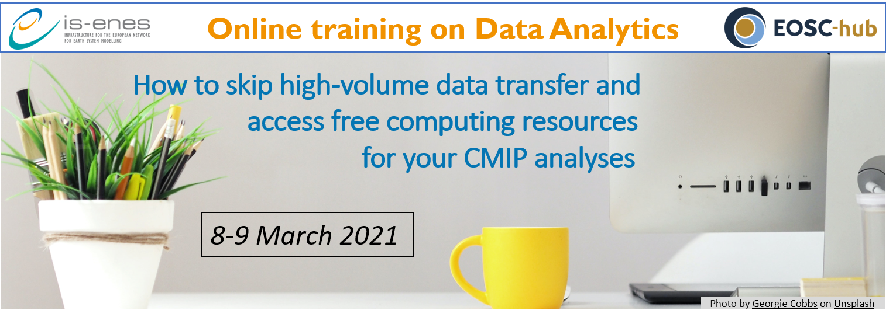
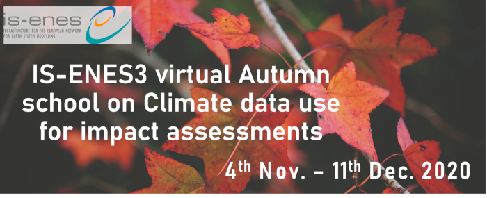

### IS-ENES3 Eastern Europe Spring Schools on Climate data and Impact assessments
- open when: **May 17, 2022**
- duration: **May 17, 2022 08:30 AM to May 19, 2022 07:00 PM (Europe/Vienna / UTC200)**

The Babeș-Bolyai University (BBU), Faculty of Geography, in collaboration with IS-ENES3, organises two parallel schools (with one common day) targeted to climate and impact researchers from Eastern Europe on 17-19th May 2022 in Cluj-Napoca, Romania.

Climate change is seen as one of the biggest challenges in our times. To be able to do climate change impact studies and to adapt to climate change the knowledge of many different disciplines is needed and knowledge on climate data and experience on analyzing and processing climate data is needed. During the spring school, organised by the Babeş-Bolyai University and the IS-ENES3 project, climate and impact researchers and students will be able to get practical experience with analyzing and processing climate data and with working together on an impact study.

The aim of the schools is to:

- get more knowledge about the various types of climate data and tools/methods to analyse/process them and get experience in using these tools/methods/data;
- learn what is needed for interdisciplinary impact/adaptation studies on climate change;
- create/broaden network on climate change and impact assessments

**The programme, practical details information and application procedure are available on the** [BBU website](https://geografie.ubbcluj.ro/cercetare/?page_id=557).

### IS-ENES3 Data Science Summer School
- open when: **Sep 01, 2022**
- duration: **Sep 01, 2022 09:00 AM to Sep 07, 2022 05:00 PM (Europe/Vienna / UTC200)**

**At a glance** |
:--------------:|:------------:
What: | One week, fully funded Summer School
When: | September 1-7, 2022
Where: | Athens, Greece
Fee: | Free of charge

Organised by the [IS-ENES3 consortium](https://is-enes3.github.io/IS-ENES-Website/partners/), this school aims to increase expertise and skills on theoretical and practical concepts of Data Science, building upon and mainly targeting how to accelerate scientific discovery from data. Early stage researchers will learn how to analyse, visualise and report on massive datasets, in the scientific domain as well as how to apply data-intensive and data-oriented paradigms and solutions to address scientific discovery in climate science.

Driven by the theoretical background provided by domain, data and computer science experts, the school will adopt a hands-on approach for maximising results focusing on the usage of datasets linked to the IS-ENES3 data services. The school will strengthen the individual expertise of the participating climate and computer scientists, as well as, leverage and emphasise the need of collaboration between them, helping early career scientists with different backgrounds to meet and network.

**Find the programme, application procedure and other information on the** [NCSR-D website](https://www.iit.demokritos.gr/is-enes-summer-school/).

### IS-ENES3 Virtual clinic on bias-adjustment of climate model data
- open when: **Oct 14, 2021**
- duration: **Oct 14, 2021 10:00 AM to Oct 21, 2021 12:00 PM (Europe/Vienna / UTC200)**

**Dates of the clinic**

The virtual clinic is divided into two meetings.
- 14th October 2021 10:00-12:00 CET
- 21st October 2021 10:00-12:00 CET

##### Background

For many studies on the impacts of climate change, bias-adjustment of the climate model simulations is a necessary step before impact models can be run or before relevant climate indices can be calculated. However, there are many methods, all with their own advantages and disadvantages. As part of the IS-ENES3 project, 3 courses on “Climate data for impact assessments” were organized, in which also some attention was paid to bias-adjustment (by Ana Casanueva, University of Cantabria). However, it was clear that the participants of the schools wanted some more in-depth information and practical exercises.

##### Who can participate

Everyone interested ! However, the workshop is meant especially for **climate researchers, impact researchers and climate service providers** who may have to do bias-adjustments or use/will use bias-adjusted climate model data.

##### Set-up the clinic

- During the first meeting, two experts in the field of bias-adjustments will give more in-depth information about e.g. quantile mapping, bias adjustment of precipitation, multivariate methods, challenges, limitations and pitfalls and non-stationary methods.
- In between the two meetings, participants are asked to either explore some tools, do an exercise that will be provided or send in an example/problem/question from their own work on bias adjustments or with bias-adjusted data.
- During the second meeting, problems and challenges of participants with bias-adjustments will be discussed, either from their own work, tools they used or the exercise that was provided during the first meeting.

##### Speakers

- **Mathieu Vrac**: Head of the ESTIMR (Extremes - Statistics - Impacts - Regionalization) group, Directeur de Recherches CNRS (Senior Research scientist) at LSCE-IPSL/CNRS
- **Douglas Maraun**: Associate Professor at the Wegener Center for Climate and Global Change and head of the Regional Climate Research Group at the University of Graz

**Register** [here](https://docs.google.com/forms/d/e/1FAIpQLSdChe9gsMkxACd4_Muny9yz5SbmwN820OsPbwWR6RmxEP-DdA/viewform) before October 12!

### XIOS training sessions
- open when: **Mar 15, 2021**
- duration: **Mar 15, 2021 02:00 PM to Apr 16, 2021 05:00 PM (Europe/Vienna / UTC100)**

The XIOS team will open two online training sessions on XIOS and dr2xml.

The first session will take place from **2pm to 5pm CET on March 15th to 19th 2021** and the second one is planned for **April 12th - 16th 2021**.

This training session will include presentations of XIOS & dr2xml and most importantly several hands-on exercises.

A dedicated webpage for this training is available [here](https://forge.ipsl.jussieu.fr/ioserver/wiki/training_2020) and information will be updated regularly including a more detailed program of the training and slides.

**The slides used for the training sessions are available [here](http://forge.ipsl.jussieu.fr/ioserver/wiki/training_2020) !**

#### What is XIOS:

The climate simulation models launched on super-computers produce a significant amount of data. At this scale, the management of output files and post-treatment on data become the  performance bottleneck for those climate models. In order to generate efficiently the output from models while taking advantage of the calculate resources, Institut Pierre Simon Laplace has launched the XIOS project.

XIOS is a library dedicated to generate efficiently and easily the parallel input/output of climate models. It uses a client-server methodology in which clients (or models) will simulate the physics and send data asynchronously to servers. It is the XIOS servers who are in charge of writing data to files. In this way, we can smooth the I/O peaks by sending to servers a constant data flux all along the simulations and the I/O is overlapped with calculates.

What's more, XIOS provides multiple functionalities which allow an "in situ" data post-treatment. For example, we can read the data from models, operate transformations on those data, combine data from different source models, and send results to multiple output files. All these operations are defined from an external XML file with a very compact and flexible way. Any modifications in this XML file will not require re-compilation of XIOS or models.

XIOS is written in C++ and uses MPI for asynchronous communications between clients and servers. NETCDF, HDF5, and MPIIO are also used in XIOS for efficient file writing.

#### What is dr2xml:

DR2XML is a python package useful for climate models whose I/O are handled by XIOS. It has been originally designed to facilitate the configuration of XIOS (automatic generation of XML files) so as to fully satisfy the CMIP6 DataRequest. With DR2XML, the NetCDF files output by the model are directly CMOR3 compliant.  Some extended functionalities were also developed so that DR2XML enables the user to set up his own Data Request. Consequently DR2XML can be used to customize the official CMIP6 DR or even to work off the CMIP6 framework, but benefiting from the CF-NetCDF, CMOR, and CMIP6 standards (file naming convention, file structure, variable definitions, file and variable attributes, etc.).

#### Registration to the training:

If you are interested in following the XIOS&dr2xml training, please fill up the [registration form](https://framaforms.org/2021-xios-training-registration-1610983252).

By applying to the XIOS virtual trainings, you agree that the IS-ENES3 project and its selection committee will collect your personal data according to the IS-ENES3 data [privacy policy](https://is-enes3.github.io/IS-ENES-Website/privacy/). Your data will only be used in the purpose of the organization of the IS-ENES3 XIOS virtual trainings. If you want to modify or erase your personal data, please send an email to <is-enes@ipsl.fr>

If you have any questions about this training, please contact Yushan Wang <yushan.wang@lsce.ipsl.fr>.

### Online Training on Data Analytics How to skip high-volume data transfer and access free computing resources for your CMIP analyses
- open when: **Mar 08, 2021 03:00 PM**
- duration: **Mar 08, 2021 03:00 PM to Mar 09, 2021 05:30 PM**

#### Synopsis
- Tired of downloading tons of climate model data?
- Are you about to overload your computer’s memory with the constant increase of data volume and you need more computing resources?

The infrastructure for the European Network of Earth System modelling ([ENES](https://portal.enes.org/)) has a new service for you! Thanks to the ENES Climate Analytics Service ([ECAS](https://portal.enes.org/data/data-metadata-service/climate-analytics-service)), which is also one of the thematic services included in the [EOSC-hub](https://www.eosc-hub.eu/) service portfolio, you can load just the data you need and straightforwardly process them. With this free of charge service, you can request computing time through the [IS-ENES](https://is-enes3.github.io/IS-ENES-Website/) infrastructure project, which hosts and maintains more than 6 Petabytes of CMIP data as the European part of the Earth System Grid Federation ([ESGF](https://esgf.llnl.gov/)).

Join our online training on March 8-9 and learn how to run your Jupyter notebooks at the German Climate Computing Center ([DKRZ](https://www.dkrz.de/de)) and the Euro-Mediterranean Center on Climate Change Foundation ([CMCC](https://www.cmcc.it/)), two of the IS-ENES compute service providers and ESGF data centers. 

We will show how to load, filter, concatenate, perform spatial and time averages, plot CMIP data for multi-model comparisons and use CMIP model results to calculate some climate indices for any location and period. The trainings include examples on how to apply the following packages for Big Data manipulation and visualization: 

- [Climate Data Operators](https://pypi.org/project/cdo/) (python-cdo),
- [Intake](https://intake.readthedocs.io/en/latest/) to easily extract the data from the huge catalog, 
- [Ophidia](https://ophidia.cmcc.it/), [Xarray](https://xarray.pydata.org/en/stable/), to easily read NetDCF files and scale for parallel computing,
- [ESMValtool](https://www.esmvaltool.org/), to reproduce or re-use existing climate analytics,
- [Matplotlib](https://matplotlib.org/stable/index.html) and [Cartopy](https://scitools.org.uk/cartopy/docs/latest/) to visualise data analysis results.

**The repository with the training materials is [here](https://github.com/IS-ENES-Data/Climate-data-analysis-service). Find the video recordings of the training in [this list](https://www.youtube.com/playlist?list=PLFvev1W5vG7P1VGITP3ys1GpXnhL--jIc) of the IS-ENES3 Youtube channel.**

Find more information on the ENES Climate Analytics Service (ECAS) [here](https://portal.enes.org/data/data-metadata-service/climate-analytics-service).

The number of spots is limited for the hands-on sessions, so early bird registration is recommended.

The course is organized around the following sessions:

- March 8
  - General introduction (3:00 pm - 5:00 pm) 
- March 9
  - DKRZ demos and hands-on session (10:00 am - 12:30 am) 
  - CMCC demos and hands-on session (3:00 pm - 5:30 pm)
  - Basic knowledge of Python, Linux, Git recommended, including general aspects about climate/weather data.

This training is co-organized jointly by the H2020 IS-ENES3 and EOSC-hub projects.

**Important notes:** unfortunately we cannot offer unlimited resources. The ECAS only provides computer resources for pre- and post-processing (not suitable for simulation runs) in shared computing nodes. If you would like to use exclusive extensive resources, please apply to our [Analysis Platforms](https://portal.enes.org/data/data-metadata-service/analysis-platforms/transnational-access-tna) service. Besides, this is a European service mainly addressed to the European earth systems community, the non-European communities are welcome if resources are available.

### Second and Third IS-ENES3 virtual School on Climate Data Use for Impact Assessments
- When: **Mar 03, 2021 09:00 AM to Jun 14, 2021 11:30 AM (Europe/Vienna / UTC100)**

### First IS-ENES3 virtual Autumn School on Climate data use for impact assessments
- When: **Nov 04, 2020 09:00 AM to Dec 10, 2020 09:00 AM (Europe/Vienna / UTC100)**

**Aim ?** The aim of the School was to help researchers make better use of available climate data and knowledge, in order to produce higher quality research outputs and services. This, in turn, will help to combat and adapt to climate change. Other aims were to develop a network of researchers who can turn to each other in the future for advice and cooperation.
**When ?** The school took place in the period from Nov. 4th to Dec. 11th, 2020.

**The recordings of the presentations can be found on the [IS-ENES3 YouTube channel](https://www.youtube.com/watch?v=_42ltTQzY30&list=PLFvev1W5vG7NDEZhxObXDd1Bc5rnBpYrk)!**

The total length of the Autumn School is six weeks. **In the first three weeks, 2-3 hour virtual meetings will be held on Wednesday and Friday mornings.** Interactive lectures on climate models, data, impact modelling and climate services are provided. Participants can bring in their own case study and will work on these in **groups of 2-3 persons during the last three weeks.** During these weeks, teachers from IS-ENES will be available for questions and help.

**Week 1: Climate data and climate models** |

*Webinar 1 Wednesday morning 4th of November* |
:--------------------------------------------:|:--------------:
10 min | [Introduction to the course: aim, learning objectives, set-up](https://raw.githubusercontent.com/IS-ENES3/IS-ENES-Website/main/pdf_documents/AS1_IS-ENES3_Autumnschool_intro.pdf)
20 min | Interactive session (wrap up of the preparation material):
       | - What different sources of climate data are there?
       | - What are the main advantages and disadvantages of the various data sources
       | - What are the main uncertainties in climate data?
       | - What methods exist to deal with these uncertainties?
       | (Those with little background knowledge on climate data are asked to follow some of the lessens provided by C3S User Learning Service as preparation)
60 min | **Presentations:**
       | **Sylvie Joussaume**: [Climate models and the international landscape of climate research and modelling and current developments](https://raw.githubusercontent.com/IS-ENES3/IS-ENES-Website/main/pdf_documents/AS2_201104_IS-ENES3_school_Joussaume_VF.pdf)
       | **Klaus Zimmerman**: [Climate model evaluation and the ESMValTool](https://raw.githubusercontent.com/IS-ENES3/IS-ENES-Website/main/pdf_documents/AS3_202010_is-enes3_esm-evaluation.pdf)
30 min | Further questions and discussion on how to use the presented information for climate impact studies (questions can also be posed during the presentations)

*Webinar 2 Friday morning 6th of November* |
:-----------------------------------------:|:------------:
20 min | Questions related to the information presented in Webinar 1
70 min | **Presentations:**
       | **Tomas Halenka**: [Downscaling techniques and regional modelling, and bias-correction](https://raw.githubusercontent.com/IS-ENES3/IS-ENES-Website/main/pdf_documents/AS4_IS-ENES3_Autumnschool_Downscaling_fin.pdf)
       | **Eric Guilyardi**: [Standards for climate data, CMIP experiments](https://raw.githubusercontent.com/IS-ENES3/IS-ENES-Website/main/pdf_documents/AS5_standards_Eric_G.pdf)
       | **Vladimir Djurdjevic**: [Climate indices and standards, uncertainties/ensembles, challenges in use of climate data](https://raw.githubusercontent.com/IS-ENES3/IS-ENES-Website/main/pdf_documents/AS6_Vladimir_6_11_2020_Webinar_2.pdf)
30 min | Further questions and discussion on how to use the presented information for climate impact studies.
       | Wrap-up: what do the participants consider the most important information/messages for their work, and what information is missing?

**Week 2: Climate impacts and climate services** |

*Webinar 3 Wednesday morning 11th November* |
:------------------------------------------:|:------------:
20 min | Interactive session (wrap up of the preparation material from C3S ULS):
       | - In what way does climate/weather impact the sectors treated in this climate impact school?
       | - What are the main uncertainties in impact modelling in this sector and how do people deal with it?
       | (Those with little background knowledge on climate impacts in various sectors are asked to follow some of the lessens provided by C3S User Learning Service as preparation)
70 min | **Presentations:**
       | **Rutger Dankers**: [Approaches used in impact modelling and examples of impact studies for water](https://raw.githubusercontent.com/IS-ENES3/IS-ENES-Website/main/pdf_documents/AS7_Impact_Modelling_11Nov2020.pdf)
       | **Vladimir Djurdjevic**: [Impact modelling and examples: agriculture/forestry](https://raw.githubusercontent.com/IS-ENES3/IS-ENES-Website/main/pdf_documents/AS8_ISENES-ImpactSchool-Djurdjevic_11_11_2020.pdf) 
30 min | Further questions and discussion how to use the presented information for climate impact studies. 

*Webinar 4 Friday 13th November* |
:-------------------------------:|:------------:
15 min | Interactive session:
       | - What are 'climate services' according to the participants?
       | - What climate services do they know, use and/or produce?
       | - What climate services do they require for their work?
75 min | **Presentations:**
       | **Rutger Dankers**: [Climate services (types, uncertainties, examples, etc.)](https://raw.githubusercontent.com/IS-ENES3/IS-ENES-Website/main/pdf_documents/AS9_Climate_Services_13Nov2020.pdf)
       | **Christian Pagé**: [Landscape of portals, tools with climate data and other data: ESGF, Copernicus, etc.](https://raw.githubusercontent.com/IS-ENES3/IS-ENES-Website/main/pdf_documents/AS10_accessing_climate_data_final.pdf) |
30 min | Further questions and discussion on how to use the presented information for climate impact studies. 
       | Wrap-up: what do the participants consider the most important information/messages for their work,and what information is missing?

**Week 3: Setting up climate impact studies and access to climate data through the Climate4Impact portal** |

*Webinar 5 Wednesday morning 18th November* |
:------------------------------------------:|:------------:
15 min | Judith Klostermann: Aim of the case studies, set-up of the work, forming small groups.
45 min | **Presentation:**
       | **Janette Bessembinder/Judith Klostermann**: [Introduction to the steps required for case studies](https://raw.githubusercontent.com/IS-ENES3/IS-ENES-Website/main/pdf_documents/AS11_IS-ENES3_Autumnschool_case_study_setup.pdf) (mainly impact analysis, but also some attention for adaptation) and problems and challenges in inter/multi/transdisciplinary work.
       | Selection of case studies. Case studies can be impact studies or development of a climate service.
60 min | Short presentation of the research question of each group.
       | Interactive session: in general we discuss what the participants should think of (e.g. how will the results of the case study be used, who are the stakeholders, context of the question, what climate data are needed, time horizon, resolution, dealing with uncertainties), use of google docs.

*Webinar 6 Friday morning 20th November* |
:---------------------------------------:|:------------:
30 min | Interactive session on what was treated in webinar 5. Could participants answer most of the questions for their case study? What was difficult?
60 min | **Presentations:**
       | **Christian Pagé**: [Introduction to the Climate4Impact portal and some examples on possible analyses (current version of the portal)](https://raw.githubusercontent.com/IS-ENES3/IS-ENES-Website/main/pdf_documents/AS12_icclim_c4i.pdf)
       | **Alessandro Spinuso**: [Introduction to the new version of the new Climate4Impact portal (under development)](https://raw.githubusercontent.com/IS-ENES3/IS-ENES-Website/main/pdf_documents/AS12_icclim_c4i.pdf)
10:30-11:00 | Further questions and discussion on how to use the presented information for climate impact studies.

**Week 4-5: Work on case studies** |
:---------------------------------:|:------------:
Wednesday or Friday morning | Session to answer questions of participants on their case study, how to find, select and process climate data, how to use climate data in an impact study, how to deal with uncertainties.

**Week 6: Work on case studies** |
:-------------------------------:|:------------:
Wednesday morning | Session to answer questions of participants on how to process climate data, how to use climate data in impact studies, how to deal with uncertainties, how to visualize and communicate results.

*Webinar 7 Friday morning 10th December* |
:---------------------------------------:|:------------:
90 min | Presenting and discussing case studies of each group
30 min | Evaluate the course

**How to apply**

To apply, you need to send a motivation letter and a CV explaining your relevant background at the following address judith.klostermann[a]wur.nl with the mail object "IS-ENES3 Autumn school application". Your motivation letter must include the following information: name, email, telephone, country, and you must indicate if you consider yourself a climate scientist, a VIA researcher (Vulnerability, Impact and Adaptation) or a climate services provider. 

**The application needs to be submitted at the latest on October 15th, 2020.**

The number of participants in the Autumn School is limited to 20 persons; with this compact group we want to create a committed ‘community’ that will help each other in the course of the six weeks of this School. This way we hope to approach the goals of a physical Autumn School of one week; which is now impossible due to Covid-19.

Applicants need a finished **MSc in one of the natural sciences** in order to guarantee fruitful participation. **The working language will be English** and participants need sufficient skill in this language. If the number of applications exceeds the maximum number of participants, participants will be selected according to the following criteria:

- The aim is a diversity of participants from climate science, impact research and climate services; a balanced mix of participants will be selected.
- The IS-ENES3 project aims to involve more researchers from Eastern and Southern Europe, so applicants from these regions will be prioritized.
 
A selection committee of three course organizers will select the participants and will let every applicant know the outcome by October 23rd, 2020. Applicants can be placed on a waiting list in case selected participants cancel their participation in the last minute. Applicants who are not selected, but who do have the required qualifications and belong to our stakeholder groups can indicate whether they want to apply  for the next schools in spring and summer of 2021.

By applying, you agree that the IS-ENES3 project and its selection committee will collect your personal data according to the IS-ENES3 data privacy policy: https://is.enes.org/project/privacy-policy. Your data will only be used in the purpose of the organisation of the IS-ENES3 Autumn school. If you want to modify or erase your personal data, please send an email to judith.klostermann[a]wur.nl. 

**Summary of the IS-ENES3 project: Infrastructure for the European Network for Earth System Modelling (2019 - 2022)**

IS-ENES3, a Horizon 2020 project, is the third phase of the distributed e-infrastructure of the European Network for Earth System Modelling (ENES). The project fosters collaboration between 22 European climate research institutions. The community aims to develop a better understanding of past, present and future climate. IS-ENES3 projects future variability and changes of the climate through the development and sharing of model components, modelling tools and data infrastructure. The IS-ENES3 three main objectives are to:
- Foster collaboration among the modelling groups to speed-up the development and use of models of the complex Earth’s climate system, generally named “Earth System models” (ESMs);
- Deliver common strategies for the research infrastructure on the global climate;
- Disseminate model data to researchers worldwide.

**Biographies of the teachers**

:--------------:|:------------:
**Janette Bessembinder** (PhD) works at the Royal Netherlands Meteorological Institute since 2005. She is involved in climate scenario and climate services development. In the Netherlands she has led several projects on the tailoring of climate data for users ranging from impact/adaptation researchers, companies to policy makers. She is or has been involved in the European projects EUSTACE, ROADAPT, WATCH, C3S ULS, Climateurope, PRIMAVERA and IS-ENES3, mostly as work package leader related to tailoring and dissemination. | 
**Judith Klostermann** (PhD) is a social science researcher at Wageningen Research and is working within the Climate Resilience team. She works in the domains of adaptation to climate change, coastal management and sustainability. She is involved in user engagement for the Copernicus Climate Data Store. She organized Communities of Practice in European projects URBANFLUXES and BRIDGE on urban climate change. | 
**Sylvie Joussaume** (PhD) is a senior scientist within National Center for Scientific Research (CNRS) in France. She is an expert in climate modelling at IPSL and has been involved in IPCC assessment reports since the third report.  She is chairing the scientific board of the European Network for Earth System modelling (ENES) and coordinates the FP7 infrastructure project IS-ENES, which integrates the European climate models in a common infrastructure (2009-2022). | 
**Vladimir Djurdjevic** (PhD) is an associate professor of meteorology at the Faculty of Physics, University of Belgrade, Serbia. He was visiting scientist at NOAA/NCEP (USA), CMCC (Italy), IST (Portugal) and ICOD (Malta). His expertise is in the field of climate modeling, climate data analysis, climate impacts, vulnerability and adaptation to climate change. He participates in the international initiative Med-CORDEX and he is a member of the International Planning Committee of the Pannex hydroclimate project. He is or has been involved in the European projects ORIENTGATE, DRIHM, GEO-CRADLE, ClimatEurope and IS-ENES3. | 
**Christian Pagé** (PhD) holds a "highly qualified" research engineer position at CERFACS. He has been active in research and development since 1995, covering a large spectrum of atmospheric sciences. He has been involved in many large projects. He is currently involved in improving access to large data volumes for use within the climate community. He has been involved in several European projects, notably FLYSAFE, EUDAT/EUDAT2020, IS-ENES/IS-ENES2, CLIPC, SPECS, DARE, often as a work package leader. He is also involved in the Earth System Grid Federation (ESGF) Compute Working Expert team, on providing data processing near the data storage for large data volumes in a federated infrastructure. | 
**Rutger Dankers** (PhD) is a physical geographer with over 15 years of experience in weather and climate impacts research. His work has focused on natural hazards and extreme events; interactions between weather, climate and society; modelling and model evaluation; and communication of risk and uncertainties. His expertise includes climate change and climate impact modelling; postprocessing of weather forecasts; analysing climate projections; processing large datasets; extreme value statistics; evaluating uncertainty; and weather and climate risk assessment. Since 2019, he works at the Climate Resilience team at Wageningen Environmental Research. | 
**Eric Guilyardi** (PhD) is a climate scientist at LOCEAN-IPSL, CNRS. He has published over 95 papers in peer-reviewed journals on topics including tropical climate variability, El Niño, ocean and climate, climate change, multi-model analysis, or state-of-the-art climate model development and has been ranked as Highly Cited scientist in 2018. Eric Guilyardi was Lead Author for IPCC AR5 and is Contributing Author for IPCC AR6. He has been involved in IS-ENES and other EU project for more than 20 years, more specifically coordinating the METAFOR and ES-DOC projects. | 
**Tomáš Halenka** (PhD) is an associate professor of meteorology at the Dept. of Atmos. Phys., Fac. of Math. and Physics, Charles University in Prague. His expertise is in the field of regional climate modeling, climate impacts, urban climate and its modeling, coupling of RCM and CTM, air quality modeling as well as vulnerability and adaptation to climate change. He was visiting scientist at Université Catholique de Louvain, Louvain-la-Neuve (Belgium), regular associate at the Abdus Salam ICTP in Trieste (Italy). He participates in the international initiative EuroCORDEX, he is a review editor of IPCC AR6, Ch. 3. He has been involved in the European projects ENSEMBLES, QUANTIFY, MEGAPOLI, IS-ENES3, specifically coordinating the CECILIA project. | 

### 1st Webinar of the demonstration of the Climate4Impact portal
- When: **Sep 16, 2019 from 01:00 PM to 02:30 PM (Europe/Vienna / UTC200)**

On September 16th from 13.00 – 14.00 CEST will take place a webinar about the [Climate4Impact portal](https://climate4impact.eu/) on how to visualize, analyse and process climate data.

The webinar is meant for impact researchers and other people with only basic knowledge of climate data.

After a short presentation about the possibilities of the Climate4Impact portal, **participants can ask questions and discuss further improvement with the developers of the portal**. A step by step guide for using the portal will be made available to the participants. 

The Climate4Impact data portal is developed within the IS-ENES-projects. The portals aims to enhance the use of climate research data by e.g. climate change impact modellers and impact and adaptation consultants. The portal offers web interfaces for searching, visualizing, analysing, processing and downloading datasets.

### EMS 2019: Second demonstration session of the Climate4Impact portal
- When: **Sep 12, 2019 from 09:00 AM to 01:00 PM (Europe/Copenhagen / UTC200)**
- Where: **EMS2019, Lyngby Campus, Side meeting SIM13, Room: S8**

A demonstration of the Climate4Impact data portal on **how to visualize, analyse and process climate data** will take place at the **European Meteorological Society meeting 2019**.

The short training is meant especially for **impact researchers** and other people with limited knowledge of climate data.

After a short presentation participants can explore the portal and get some support.  A step-by-step guide for using the portal will be made available to the participants. 

The Climate4Impact data portal is developed within the IS-ENES-projects. The portal aims to enhance the use of climate research data by e.g. climate change impact modelers and impact and adaptation consultants. The portal offers web interfaces for searching, visualizing, analysing, processing and downloading datasets.

Date and Venue:
The demonstration is given on September 12, 09:00–13:00
EMS2019, Lyngby Campus, Side meeting SIM13,  Room: S8

Bring your own laptop!

### EGU 2019: First demonstration session Climate4Impact portal for the IS-ENES3 project
- When: **Apr 09, 2019 from 08:03 AM to 10:15 AM (Europe/Vienna / UTC200)**
- Where: **EGU2019, Vienna, Austria**

The Climate4impact portal was developed in the two previous phases of the IS-ENES project. With the start of the IS-ENES3 project in January 2019, this portal for accessing, visualizing and processing climate data will be further developed and updated. To promote the use of the portal, a considerable number of demonstrations sessions and short trainings will be given.

The first demonstration sessions of about an hour each were organized during **splinter sessions at the EGU on Tuesday April 9, 2019.**

Wim Som de Cerff and Maarten Plieger gave short demonstrations after which the participants had some time to explore the portal with the help of an example. A **step-by-step guide** with information on how to login, download data and some further examples on how to process and visualize data was sent to the participants to make it easier for them to explore the portal further. A **follow-up webinar** will be organized where participants can ask further questions and where we like to collect feedback on the portal for further developments.
