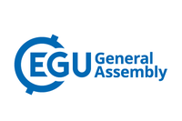
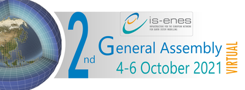
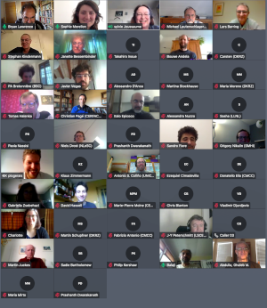
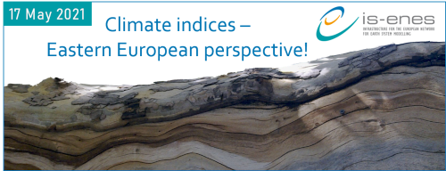
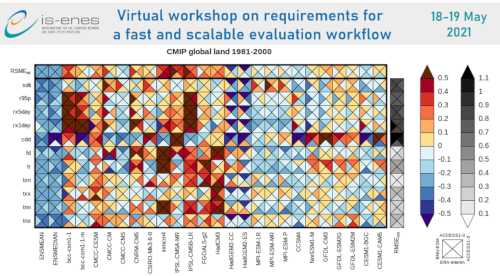
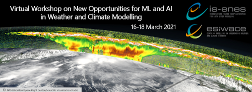
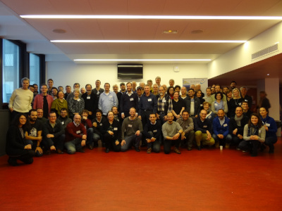
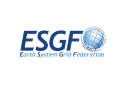
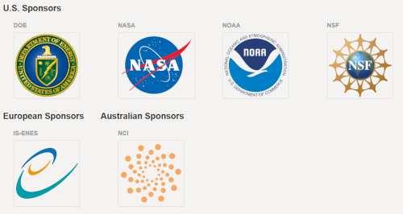
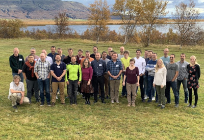

### IS-ENES3 Final General Assembly

The project Final General Assembly will be held on **January 16-18, 2023** at the “Centre International de Conférences” on Météo-France campus in **Toulouse, France**. The workshop will be held in a **hybrid format** with remote attendance possible.
The General Assembly will start on Mon. 16 January with a welcome coffee at 12:30pm CET, and end on Wed. 18 January at 1:00pm CET (lunch time included). 

Find the **full programme** [here](https://raw.githubusercontent.com/IS-ENES3/IS-ENES-Website/main/pdf_documents/Agenda_IS-ENES3_Final_GA_V2.pdf). 

**Register [here](https://docs.google.com/forms/d/e/1FAIpQLSdse_55PLDL00rUrDQTrv7WzwCDWudNW2rAK_e6WdlJivDjHQ/viewform?usp=sf_link) before December 23th if you attend onsite, and before January 12th if you attend virtually !**

An IS-ENES3 social dinner will be organised on Tuesday 17th evening in downtown Toulouse, at the [Brasserie des Beaux-Arts](https://brasserielesbeauxarts.fr/).
Before the social dinner you can join an historical sightseeing tour of downtown Toulouse with an English guide (starting at 6:30pm CET, for a 1h15 walking tour)!

- [List of hotels in Toulouse](https://raw.githubusercontent.com/IS-ENES3/IS-ENES-Website/main/pdf_documents/List_of_hotels_in_Toulouse.pdf)
- [Access map to the venue](https://raw.githubusercontent.com/IS-ENES3/IS-ENES-Website/main/pdf_documents/Access_Plan_CIC.pdf)

Contact: sophie.morellon[a]lsce.ipsl.fr

### Sixth Workshop on Coupling Technologies for Earth System Models (CW2023)

The 6th Workshop on Coupling Technologies for Earth System Models (CW2023) will be held on **January 18-20, 2023** at the “Centre International de Conférences” on Météo-France campus in **Toulouse, France**. The workshop will be held in a **hybrid format** with remote attendance possible.

Find all information on the [official webpage](https://portal.enes.org/cw2023-toulouse/). 

### International ESGF Hybrid Conference Toulouse/Oak Ridge 

The International ESGF Hybrid Conference Toulouse/Oak Ridge will be held on **January 18-19, 2023** at the “Centre International de Conférences” on Météo-France campus in **Toulouse, France**, in parallel with the Coupling Workshop 2023. The workshop will be held in two different locations at the same time: Toulouse (France) for the EU side, Oak Ridge (USA) for the American side, with a visioconference system to link both places. 

The workshop will start on Wed. 18 January at 2:00pm CET with a welcome coffee.
Sessions will be held on:
Wednesday 18 : 2:45-6:00pm // 8:00-10:00pm CET
Thursday 19 :  2:00-6:00pm // 8:00-10:00pm CET

**Register [here](https://docs.google.com/forms/d/e/1FAIpQLSeKZFwWXbubepQqxFTvg2CuernAJBf0iFeBk78aCXQdX5-W-A/viewform?usp=sf_link) !**
Deadline: **January 4th** if you come onsite, **January 12th** of you attend virtually ! 

Social dinners and evening sessions for both days will take place at the [Novotel Toulouse Centre Wilson](https://www.google.fr/maps/place/H%C3%B4tel+Novotel+Toulouse+Centre+Wilson/@43.6051828,1.4446689,17z/data=!3m2!4b1!5s0x12aebc9e9647c0d3:0x8aec8c04997407dd!4m8!3m7!1s0x12aebc9e0785e8eb:0x91ce3991b4d387cb!5m2!4m1!1i2!8m2!3d43.6051828!4d1.4468576?hl=fr).

- [List of hotels in Toulouse](https://raw.githubusercontent.com/IS-ENES3/IS-ENES-Website/main/pdf_documents/List_of_hotels_in_Toulouse.pdf)
- [Access map to the venue](https://raw.githubusercontent.com/IS-ENES3/IS-ENES-Website/main/pdf_documents/Access_Plan_CIC.pdf)

### 2022 CF Workshop

2022 CF Workshop will take place on 13-15 September 2022 hosted by [IFCA](https://ifca.unican.es/en-us) at Santander (Spain). After 2 successful virtual editions (2020 and 2021), the 2022 edition is organized as a hybrid event having in-person and on-line participants.

The Climate and Forecast metadata conventions (CF) are a community-developed standard designed to promote the processing and sharing of climate and forecast model and observational output data, and derived data products. The conventions define metadata that provide a definitive description of what the data in each variable represents, and the spatial and temporal properties of the data. This enables users of data from different sources to decide which quantities are comparable, and facilitates building applications with powerful extraction, regridding, and display capabilities. The CF convention includes a standard name table, which defines strings that identify physical quantities.

**Find all the information (including the agenda) and the registration procedure on the event [official webpage](http://cfconventions.org/Meetings/2022-Workshop.html).**
Registration deadline: 30 August 2022

### 1st ESMValTool Workshop 2022

The first ESMValTool Workshop 2022 took place at DLR Oberpfaffenhofen from 13–15 June as a hybrid meeting. Participants were from BSC, DLR, Met Office, NLeSC, PML, SMHI, U Bremen and U Reading. The main goal of the workshop was to bring together the development community, discuss future strategies and provide updates on progress since the last workshop in November 2022. 

**Find the detailed workshop report [here](https://raw.githubusercontent.com/IS-ENES3/IS-ENES-Website/main/pdf_documents/Summary_ESMValTool_Workshop_Jun_2022.pdf)**

### 7th ENES HPC Workshop Barcelona 2022

**Find all details about this workshop on the [ENES Portal](https://portal.enes.org/hpc-workshops-detailed/#hpc7)**

### IS-ENES3 at EGU2022
- duration: **May 23, 2022 09:00 AM to May 27, 2022 08:00 PM (Europe/Vienna / UTC200)**

- SC5.14 - [Earth System Model Evaluation with ESMValTool in the Jupyter notebook](https://meetingorganizer.copernicus.org/EGU22/session/43187)
  - Convener: Bouwe Andela
  - Co-conveners: Fakhereh Alidoost, Carsten Ehbrecht,Peter C. Kalverla, Klaus Zimmermann
- ITS3.3/CL3.2.20 - [From vision to action: transdisciplinary approaches for providing climate change impact and adaptation information and capacity development](https://meetingorganizer.copernicus.org/EGU22/session/43594)
  - Convener: Jörg Cortekar
  - Co-conveners: Judith Klostermann,Janette Bessembinder,Stefan Kienberger
- ESSI2.7 – [Meeting Exascale Computing Challenges with Compression and Pangeo](https://meetingorganizer.copernicus.org/EGU22/session/42046)
- EGU22-7869 - CPMIP: Computational evaluation of the new era of complex Earth System Models. Multi-model results from CMIP6 and challenges for the exascale computing, by Mario Acosta and V. Balaji.
- EGU22-7151 - Storage growth mitigation through data analysis ready climate datasets using HDF5 Virtual Datasets, by Ezequiel Cimadevilla and Antonio S. Cofiño
- ESSI3.3 – [Free and Open Source Software (FOSS), Cloud-based Technologies and HPC to Facilitate Collaborative Science](https://meetingorganizer.copernicus.org/EGU22/session/42416)
- EGU22-7330 - ENES Data Space: an open, cloud-enabled data science environment for climate analysis, by Fabrizio Antonio et al.
- CL5.1.1 – [Climate Services - Underpinning Science](https://meetingorganizer.copernicus.org/EGU22/session/42621)
- EGU22-6372 - Better Tailoring of Climate Information for End Users using Targeted Interfaces and Tools, by Christian Pagé et al.
- CR6.1 – [Rapid changes in sea ice: processes and implications](https://meetingorganizer.copernicus.org/EGU22/EGU22-11971.html)
- EGU22-11971 - Emergence of a sub-ice platelet layer in mushy-layer sea ice model simulations, by Martin Vancoppenolle et al
- OS1.11 – [Under cover: The Southern Ocean’s connection to sea ice and ice shelves](https://meetingorganizer.copernicus.org/EGU22/EGU22-7257.html)
- EGU22-7257 - Drivers of Antarctic sea-ice advance date, by Kenza Himmich et al.

### 2nd Technical ESMValTool Workshop 2021
- open when: **Nov 23, 2021**
- duration: **Nov 23, 2021 10:00 AM to Nov 25, 2021 05:00 PM**

**You can find the summary report of the workshop** [here](https://raw.githubusercontent.com/IS-ENES3/IS-ENES-Website/main/pdf_documents/Summary_ESMValTool_Workshop_Nov_2021.pdf)

The Second Technical ESMValTool Workshop 2021 took place via video call from 23-25 November 2021 with 34 participants from BSC, DLR, Met Office, NLeSC, PML, SMHI, U Bremen and U Reading. The main goal of the workshop was to bring together the development community, discuss future strategies and provide updates on progress since the last workshop in May 2021. Specifically, the workshop included the following topics and side meetings:

- Latest developments: mamba Installation, highlights v2.4, automatic download of missing data, selection of time rages
- Native model grids and diagnostics for monitoring model runs
- Support for regional models
- Testing recipes
- Non-backward compatible changes
- General discussion
- Side meetings:
  - user engagement team
  - cross team meeting
  - pinning dependencies

### IS-ENES3 virtual 2nd General Assembly
- open when: **Oct 04, 2021**
- duration: **Oct 04, 2021 09:00 AM to Oct 06, 2021 05:00 PM (Europe/Vienna / UTC200)**

- **You can find the event report of the workshop** [here](https://raw.githubusercontent.com/IS-ENES3/IS-ENES-Website/main/pdf_documents/IS-ENES3_M1.4.pdf)
- **You can find the agenda of the workshop** [here](https://raw.githubusercontent.com/IS-ENES3/IS-ENES-Website/main/pdf_documents/Agenda_IS-ENES3_Virtual_GA2_v4.pdf)

**Table of presentations:**

##### Monday, October 4th
**9h30-12h30: Session 1 - Plenary session**

Time Slot | Author(s) and presentation
:--------:|:--------------------------:
9h30-10h15 | [Overview of IS-ENES3](https://raw.githubusercontent.com/IS-ENES3/IS-ENES-Website/main/pdf_documents/IS-ENES3_GA2_overview_v2.pdf) - Sylvie Joussaume & Bryan Lawrence
           | [Update on sustainability (WP2-NA1)](https://raw.githubusercontent.com/IS-ENES3/IS-ENES-Website/main/pdf_documents/IS-ENES_GA2_WP2-NA1_sustain.pdf) - Fanny Adloff
10h15-10h55 | [NextGEMS – Next Generation Earth Modelling Systems](https://raw.githubusercontent.com/IS-ENES3/IS-ENES-Website/main/pdf_documents/20211004_NextGEMSENES.pdf) - Björn Stevens, MPI-M
            | [ESM2025 – Earth System Models for the future](https://raw.githubusercontent.com/IS-ENES3/IS-ENES-Website/main/pdf_documents/ESM2025_ISENES3_AGM_RolandSfrian.pdf) - Roland Séférian, MF-CNRM
10h55-11h10 | [Results from the HPC survey](https://raw.githubusercontent.com/IS-ENES3/IS-ENES-Website/main/pdf_documents/IS-ENES3_GA2_CarbonFootprint_Action7.pdf) – Claire Lévy, IPSL-LOCEAN
            | [About the estimation of energy-cost of data transfer](https://raw.githubusercontent.com/IS-ENES3/IS-ENES-Website/main/pdf_documents/IS-ENES3_GA2_About_the_estimation_of_the_energy-cost_of_data_transfer.pdf) – Jean-Claude André
11h25-12h30 | General project information, budget assessment for 2022 and reallocations – Sophie Morellon & Sylvie Joussaume

**14h30-16h30: Session 2 - Model Evaluation**

Time Slot | Author(s) and presentation
:--------:|:--------------------------:
14h30-14h55 | [WP debriefings WP3-NA2, WP5-NA4, WP6-VA1, WP7-VA2, WP9-JRA2](https://raw.githubusercontent.com/IS-ENES3/IS-ENES-Website/main/pdf_documents/IS-ENES3_GA2_WP3_WP5_WP6_WP7_WP9.pdf) - Kim Serradell & Rémi Kazeroni
14h55-15h45 | [Survey results on model evaluation and perspectives](https://raw.githubusercontent.com/IS-ENES3/IS-ENES-Website/main/pdf_documents/SurveyAG_ISENES3_2021.pdf) – Jérôme Servonnat
            | [Overview of ESMValTool progress – Rémi Kazeroni](https://raw.githubusercontent.com/IS-ENES3/IS-ENES-Website/main/pdf_documents/IS-ENES3_GA2_ESMValTool_Kazeroni.pdf)
            | [Provenance and technical standards (WP3-NA2, WP5-NA4](https://raw.githubusercontent.com/IS-ENES3/IS-ENES-Website/main/pdf_documents/IS-ENES3_GA2_DiagnosticStandards_JavierVegas.pdf) – Kim Serradell & Javier Vegas
15h45-16h30 | Model Evaluation: cross-workpackage issues

##### Tuesday, October 5th
**10h-12h: Session 3 - Data, metadata and other data software**

Time Slot | Author(s) and presentation
:--------:|:--------------------------:
10h-10h25 | [WP debriefings (WP5-NA4, WP7-VA2, WP10-JRA3)](https://raw.githubusercontent.com/IS-ENES3/IS-ENES-Website/main/pdf_documents/IS-ENES3_GA2_WP5-WP7-WP10.pdf)
10h25-11h25 | [ESGF architecture](https://raw.githubusercontent.com/IS-ENES3/IS-ENES-Website/main/pdf_documents/IS-ENES3_GA2_ESGF_Architecture.pdf) – Philip Kershaw
            | [Climate4impact portal 2.0](https://raw.githubusercontent.com/IS-ENES3/IS-ENES-Website/main/pdf_documents/IS-ENES3_GA2_Climate4Impact.pdf) – Alessandro Spinuso
            | [Update on user requirements (including climate indices)](https://raw.githubusercontent.com/IS-ENES3/IS-ENES-Website/main/pdf_documents/WP_debriefing_GA2_WP3_NA2_user_requirements.pdf) – Janette Bessembinder
            | [ES-DOC](https://raw.githubusercontent.com/IS-ENES3/IS-ENES-Website/main/pdf_documents/IS-ENES3_GA2_ES-DOC_status_update.pdf) – Sadie Bartholomew
11h25-12h | Data, metadata and other data software: cross-workpackage issues and introduction to breakout groups

**14h30-16h30: Session 4 - Models, Tools and HPC**

Time Slot | Author(s) and presentation
:--------:|:--------------------------:
14h30-14h55 | [WP debriefings (WP4-NA3, WP6-VA1, WP8-JRA1)](https://raw.githubusercontent.com/IS-ENES3/IS-ENES-Website/main/pdf_documents/IS-ENES3_GA2_WP4-WP6-WP8.pdf)
14h55-15h55 | [Recent developments in XIOS](https://raw.githubusercontent.com/IS-ENES3/IS-ENES-Website/main/pdf_documents/AG-ISENES3-recent_developments_in_xios.pdf) – Yann Meurdesoif
            | [Update on Cylc/Rose](https://raw.githubusercontent.com/IS-ENES3/IS-ENES-Website/main/pdf_documents/IS-ENES3_GA2_Cylc_Rose_Update.pdf) – David Matthews
            | [Update on NEMO Sea Ice model](https://raw.githubusercontent.com/IS-ENES3/IS-ENES-Website/main/pdf_documents/IS-ENES3_GA2_NEMO-sea-ice_Blockley_Vancoppenolle.pdf) – Ed Blockley & Martin Vancoppenolle
            | [NEMO HPC Working Group](https://raw.githubusercontent.com/IS-ENES3/IS-ENES-Website/main/pdf_documents/IS-ENES3_GA2_Epicoco_NEMO_HPC-WG.pdf) – Italo Epicoco
15h55-16h35 | Models, Tools and HPC: cross-workpackage issues and introduction to breakout groups

### IS-ENES3 virtual First General Assembly
- open when: **Mar 25, 2020**
- duration: **Mar 25, 2020 to Mar 27, 2020 (Europe/Vienna / UTC100)**

The **IS-ENES3 Virtual First General Assembly** was held on the **25th-27th of March 2020**. Initially planned in Toulouse (Centre International de Conférences), the Covid-19 situation compelled the project to turn it into a remote meeting. More than 100 persons joined throughout the three days to attend presentations of the project activities (organized in sessions according to the three main themes: Data, metadata and software; Models, tools and HPC; model Evaluation) and participate to discussions on various topics.

Find the presentations within the agenda, by clicking on the title of the presentations.

**Agenda**

- **Wednesday 25th March**
*10h-13h - Session 1: Integration and sustainability*

Time Slot | Author(s) and presentation
:----------:|:--------------------------:
10h-10h15 | [Overview of IS-ENES3](https://raw.githubusercontent.com/IS-ENES3/IS-ENES-Website/main/pdf_documents/S11_IS-ENES3_GA1_overview.pdf) - Sylvie Joussaume & Bryan Lawrence
10h20-10h35 | [Introduction to sustainability (WP2-NA1)](https://raw.githubusercontent.com/IS-ENES3/IS-ENES-Website/main/pdf_documents/S12_IS-ENES3_GA1_Sustainability.pdf) - Michael Lautenschlager, Fanny Adloff
10h50-11h00 | [Introduction to user engagement](https://raw.githubusercontent.com/IS-ENES3/IS-ENES-Website/main/pdf_documents/S13_IS-ENES3_GA1_user_engagement_v2.pdf) - Janette Bessembinder, Eric Guilyardi
11h00-11h15 | [Downstream data usage](https://raw.githubusercontent.com/IS-ENES3/IS-ENES-Website/main/pdf_documents/S14_IS-ENES3_GA1_Downstream_data_usage.pdf) – Janette Bessembinder
11h45-12h05 | [Introduction to innovation (including Copernicus C3S)](https://raw.githubusercontent.com/IS-ENES3/IS-ENES-Website/main/pdf_documents/S15_IS-ENES3_GA1_Innovation.pdf) – Martin Juckes, Fanny Adloff
12h20-12h20 | [Preparing the RP1 report](https://raw.githubusercontent.com/IS-ENES3/IS-ENES-Website/main/pdf_documents/Preparing_the_Reporting_Period_1_Sophie_Morellon_v2_SJ.pdf) – Sophie Morellon
12h30-12h40 | [Autumn Data School](https://raw.githubusercontent.com/IS-ENES3/IS-ENES-Website/main/pdf_documents/S17_IS-ENES3_GA1_Autumn_School.pdf) – Judith Klostermann
12h40-12h50 | [Carbon Footprint working group](https://raw.githubusercontent.com/IS-ENES3/IS-ENES-Website/main/pdf_documents/S18_IS-ENES3_GA1_CarbonFootprint-comp.pdf) – Sophie Valcke et al.

*14h30-17h30 Session 2: Data, metadata and other software*

Time Slot | Author(s) and presentation
:----------:|:--------------------------:
14h30-14h45 | [WP debriefings: WP5-NA4, WP7-VA2, WP10-JRA3](https://raw.githubusercontent.com/IS-ENES3/IS-ENES-Website/main/pdf_documents/S21_IS-ENES3_GA1_WP5_WP7_WP10.pdf) - Phil Kershaw, Klaus Zimmermann, Stephan Kindermann, Wim Som de Cerff, Sandro Fiore, Christian Pagé
14h55-15h10 | [Status of ESGF for CMIP6](https://raw.githubusercontent.com/IS-ENES3/IS-ENES-Website/main/pdf_documents/S22_IS-ENES3_GA1_CMIP6-ESGF.pdf) - Stephan Kindermann
15h10-15h25 | [Status of ES-DOC for CMIP6](https://raw.githubusercontent.com/IS-ENES3/IS-ENES-Website/main/pdf_documents//S23_IS-ENES3_GA1_ES-DOC-v2.pdf) - David Hassell
15h25-15h40 | [Perspectives on possible Future architecture for ESGF](https://raw.githubusercontent.com/IS-ENES3/IS-ENES-Website/main/pdf_documents/IS-ENES3_GA2_CarbonFootprint_Action7.pdf) – Philip Kershaw
15h40-15h55 | [Perspectives on compute services for ESGF](https://raw.githubusercontent.com/IS-ENES3/IS-ENES-Website/main/pdf_documents/S25_IS-ENES3_GA1_ComputeService_Fiore.pdf) – Sandro Fiore
16h35-16h45 | [Data, metadata and other data software: presentation of cross-WP issues](https://raw.githubusercontent.com/IS-ENES3/IS-ENES-Website/main/pdf_documents/S26_Cross-WP_Data_Session.pdf) 

- **Thursday 26th March**
*10h-13h - Session 3: Models, Tools and HPC*

Time Slot | Author(s) and presentation
:----------:|:--------------------------:
10h-10h15 | [WP debriefings: WP4-NA3, WP6-VA1, WP8-JRA1](https://raw.githubusercontent.com/IS-ENES3/IS-ENES-Website/main/pdf_documents/S31_IS-ENES3_GA1_WP4_WP6_WP8.pdf) - Jean-Christophe Rioual, Mario Acosta, Uwe Fladrich, Eric Maisonnave, Sophie Valcke, Italo Epicoco
10h25-10h35 | [Cylc and Rose: latest news)](https://raw.githubusercontent.com/IS-ENES3/IS-ENES-Website/main/pdf_documents/S32_IS-ENES3_GA1_Cylc.pdf) - David Matthews
10h35-10h45 | [XIOS: where are we and example of use](https://raw.githubusercontent.com/IS-ENES3/IS-ENES-Website/main/pdf_documents/S33_IS-ENES3_GA1-XIOS.pdf) - Yann Meuredesoif
10h45-10h55 | [OASIS3-MCT latest news](https://raw.githubusercontent.com/IS-ENES3/IS-ENES-Website/main/pdf_documents/S34_IS-ENES3_GA1_OASIS3-MCT.pdf) – Sophie Valcke
11h20-11h35 | [European sea ice modelling integrated initiative](https://raw.githubusercontent.com/IS-ENES3/IS-ENES-Website/main/pdf_documents/EdBlockley_IS-ENES3-GA_March2020-trim.pdf) – Ed Blockley, Martin Vancopenolle
11h35-11h50 | [NEMO: improving performance results from IS-ENES3 and other projects (ESiWACE2, IMMERSE)](https://raw.githubusercontent.com/IS-ENES3/IS-ENES-Website/main/pdf_documents/S36_IS-ENES3_GA1_Epicoco_NEMO_improvements.pdf) – Italo Epicoco
11h50-12h05 | [Model performance: results for CMIP6](https://raw.githubusercontent.com/IS-ENES3/IS-ENES-Website/main/pdf_documents/S37_IS-ENES3_GA1_MarioAcostaCPMIP_presentation_final.pdf) – Mario Acosta
12h20-12h30 | [Models, tools, HPC: presentation of cross-WP issues](https://raw.githubusercontent.com/IS-ENES3/IS-ENES-Website/main/pdf_documents/S38_IS-ENES3_GA1_cross-WP-issues_ModelsToolsHPC-comp.pdf) – Sophie Valcke et al.
12h30-12h45 | Innovation for “Models, Tools and HPC” – Graham Riley
12h45-13h   | Machine learning/AI – Graham Riley

*14h30-17h30 - Session 4: Model Evaluation*

Time Slot | Author(s) and presentation
:----------:|:--------------------------:
14h30-14h50 | [WP debriefings: WP3-NA2, WP5-NA4, WP6-VA1, WP7-VA2, WP9-JRA2](https://raw.githubusercontent.com/IS-ENES3/IS-ENES-Website/main/pdf_documents/S41_IS-ENES3_GA1_WP3_WP5_WP6_WP7_WP9.pdf) - Eric Guilyardi, Klaus Zimmermann, Uwe Fladrich, Stephan Kindermann, Björn Brötz, Kim Serradell
15h05-15h25 | [ESMValTool (IS-ENES3 and CRESCENDO)](https://raw.githubusercontent.com/IS-ENES3/IS-ENES-Website/main/pdf_documents/S42_IS-ENES3_GA1_ESMValTool_Broetz.pdf) - Björn Brötz
15h25-15h40 | [Update on interfacing the CLIVAR ENSO package with ESMValTool](https://raw.githubusercontent.com/IS-ENES3/IS-ENES-Website/main/pdf_documents/S43_IS-ENES3_GA1_ENSO_interface.pdf) - Eric Guilyardi, Javier Vegas-Regidor, Kim Serradell, Yann Planton
16h10-16h20 | [Model Evaluation: Presentation of cross-workpackage issues](https://raw.githubusercontent.com/IS-ENES3/IS-ENES-Website/main/pdf_documents/S44_IS-ENES3_GA1_Evaluation_breakout_group.pdf)

- **Friday 27th March**
*10h-13h Session 5: Cross-WP issue discussions*

Data, metadata and other software

Time Slot | Author(s) and presentation
:----------:|:--------------------------:
10h-11h | Model Evaluation, C4I and link with the Compute Service – Björn Brötz, Christian Pagé
11h-12h | ENES CDI – Sandro Fiore, Stephan Kindermann
12h-13h | ESGF Future Architecture – Mario Acosta

 Models, tools and HPC
 
Time Slot | Author(s) and presentation 
:-----------:|:--------------------------:
10h-11h30 | XIOS benchmarks – Sophie Valcke, Mario Acosta
11h30-13h | Computational evaluation of ESMs, including coupling issues (LUCIA) and energy consumption – Mario Acosta

*14h/14h30-16h/16h30 - Session 6: “Around coffee” parallel discussions*

Time Slot | Author(s) and presentation
:----------:|:--------------------------:
14h30-16h | Carbon footprint group - Sophie Valcke
14h30-15h15 | Copernicus and climate projections - Martin Juckes 
15h15-16h30 | Climate indices standards - Lars Bärring, Christian Pagé 

### Workshop "Climate Indices-Eastern European perspective"
**Sep 27, 2021** from 11:00 AM to 03:00 PM

The IS-ENES3 consortium organizes an online workshop ‘Climate indices - Eastern European perspective’. The workshop will **be an online effort to collect information on the current status about usage and implementation of different climate indices in the region, which will be the starting point to draft requirements and recommendations for the future**. It will be organized as two online meetings, combined with online surveys and online interviews between them.

- **Initial meeting**: 17th May, 2021 (9:30 AM to 12:00 PM CEST)
- **Survey and interview** : June and July, 2021
- **Final workshop**: 27th September, 2021 (11:00 AM to 3:00 PM CEST)

**The aim of the workshop?** Used by a broad user community for many applications outside the climate science community, climate indices provide compact information on key physical parameters. A reference specification of the indices has been developed by joint CCl/CLIVAR/JCOMM Expert Team (ET) on Climate Change Detection and Indices (ETCCDI), and these have been implemented in the ICCLIM tool and many others. The workshop will evaluate and review the usage of existing indices and explore the need for additional ones in these broader and new communities.

**Who organizes it?**  Researchers from the IS-ENES3 consortium. These researchers will interact directly with the workshop participants. Beside many activities, IS-ENES3 project aims at further engaging with the community of users of IS-ENES services, by widening the user base through training, engaging the community in co-constructing standards and expressing needs, and engaging the younger generation in interdisciplinary approaches.

**For whom?** This workshop is for climate scientists and researchers from different disciplines (agriculture, forestry, water resources, public health etc) that often use different climate indices. We aim to create a mix of different disciplines so that recommendations will follow needs from broad research communities.

**What is the programme?** The initial online meeting will be organized to present the main goals and planned output of the final workshop together with the discussion on current status and potential future developments. After the meeting the online survey will be initialized together with online interviews, from which a set of recommendations will be drafted. The topics related to the climate indices that will be covered are: indices definition and usage, data sources, software for calculation and visualization, current gaps and limitations.

Contact: vdj[at]ff.bg.ac.rs

***Find the final report "M3.5 - Workshop on climate indice - Eastern Europe perspective" [here](https://raw.githubusercontent.com/IS-ENES3/IS-ENES-Website/main/pdf_documents/IS-ENES3_M3.5_vf.pdf)***

-  **Presentations from the initial meeting (May 17th)**

Presentation | Author(s) 
:-----------:|:---------:
[IS-ENES3 project introduction](https://raw.githubusercontent.com/IS-ENES3/IS-ENES-Website/main/pdf_documents/01_JoussaumeS_IS-ENES_European_research_infrastructure_for_Earth_System_Models_s.pdf) | WP debriefings (WP4-NA3, WP6-VA1, WP8-JRA1)
[Indices workshop goals](https://raw.githubusercontent.com/IS-ENES3/IS-ENES-Website/main/pdf_documents/02_DjurdjevicV_Indices_workshop_goals.pdf) | Vladimir Djurdjevic (FPUB)
[ETCCDI indices: recap and usage examples](https://raw.githubusercontent.com/IS-ENES3/IS-ENES-Website/main/pdf_documents/03_BarringL_Climate_indices_latest_developments_and_application_examples_s.pdf) | Lars Bärring (SHMI)
[ICCLIM and Climate4impact tool](https://raw.githubusercontent.com/IS-ENES3/IS-ENES-Website/main/pdf_documents/04_PageC_ICCLIM_and_Climate4impact_Tool.pdf) | Christian Pagé (CERFACS)
[Regional perspective: Previous analysis (presentation of ORIENTGATE survey and analysis report)](https://raw.githubusercontent.com/IS-ENES3/IS-ENES-Website/main/pdf_documents/05_KrzicA_Regional_perspective_Previous_analysis_ORIENTGATE_survey_and_analysis_report.pdf) | Aleksandra Krzic (RHMSS/FPUB)
[Next steps: survey, interviews and the planned content of the final report](https://raw.githubusercontent.com/IS-ENES3/IS-ENES-Website/main/pdf_documents/06_DjurdjevicV_Next_steps.pdf) | Vladimir Djurdjevic (FPUB)

- **Presentations from the final meeting (September 27th)**

Presentation | Author(s) 
:-----------:|:---------:
[Workshop Climate indices - past activities and next steps](https://raw.githubusercontent.com/IS-ENES3/IS-ENES-Website/main/pdf_documents/1_Workshop_Climate_indices_past_activities_and_next_steps.pdf) | Vladimir Djurdjevic (FPUB)
[Changes in temperature extremes in Romania](https://raw.githubusercontent.com/IS-ENES3/IS-ENES-Website/main/pdf_documents/2_Changes_in_temperature_extremes_in_Romania.pdf) | Adina-Eliza Croitoru et al. (1) Babes-Bolyai University, Romania; 2) JRC, Italy)
[Application of Climate Indices in the Regional Climatology over Southeast Europe](https://raw.githubusercontent.com/IS-ENES3/IS-ENES-Website/main/pdf_documents/3_Application_of_Climate_Indices_in_the_Regional_Climatology_over_Southeast_Europe.pdf) | Hristo Chervenkov (National Institute of Meteorology and Hydrology, Bulgaria)
[Use of Climate Indices in R. N. Macedonia: ClimDex and ClimPACT](https://raw.githubusercontent.com/IS-ENES3/IS-ENES-Website/main/pdf_documents/4_Use_of_Climate_Indices_in_R_N_Macedonia_ClimDex_and_ClimPACT.pdf) | Aleksandar D. Prodanov (National Hydrometeorological Service, N. Macedonia)
[Sectoral climate indices studies in Turkey](https://raw.githubusercontent.com/IS-ENES3/IS-ENES-Website/main/pdf_documents/5_Sectoral_climate_indices_studies_in_Turkey.pdf) | Serhat Şensoy (Turkish State Meteorological Service)
[Operational use of climate indices in RHMSS](https://raw.githubusercontent.com/IS-ENES3/IS-ENES-Website/main/pdf_documents/6_Operational_use_of_climate_indices_in_RHMSS.pdf) | Dragan Mihic (Republic Hydrometeorological Service, Serbia)
[Climate indices - Presentation of the survey results](https://raw.githubusercontent.com/IS-ENES3/IS-ENES-Website/main/pdf_documents/7_Climate_indices_Presentation_of_the_survey_results.pdf) | Aleksandra Krzic (RHMSS/FPUB)
[Climate indices report - main conclusions](https://raw.githubusercontent.com/IS-ENES3/IS-ENES-Website/main/pdf_documents/8_Climate_indices_report_main_conclusions.pdf) | Vladimir Djurdjevic (FPUB)

### 2021 Climate and Forecast Conventions (CF) Workshop
- When: **Sep 21, 2021 03:00 PM to Sep 23, 2021 03:00 PM (Europe/Vienna / UTC200)**

The 2021 CF Workshop will be a virtual meeting on 21-23 September 2021. The meeting will run for three hours on each day, 15:00 to 18:00 UTC, plus an informal hour at the end of each day.

**Find the detailed programme [here](https://cfconventions.org/Meetings/2021-Workshop.html).**

*This workshop has been supported by the IS-ENES3 project.*

### IS-ENES3 Virtual workshop on requirements for a fast and scalable evaluation workflow
- When: **May 18, 2021 02:00 PM to May 19, 2021 06:00 PM (Europe/Vienna / UTC200)**

The **“IS-ENES3 Virtual workshop on requirements for a fast and scalable evaluation workflow”**  is a web meeting organized in the context of the EU H2020 IS-ENES3 project in close collaboration with the **ESMValTool development team**.

The workshop aims to bring together leading researchers and software engineers in the field of **evaluation frameworks for Earth System Models to discuss users’ requirements, current solutions and to identify gaps and challenges about the next evaluation workflows**.

In this workshop, current and future requirements (such as input data size, memory footprint, reproducibility and computation time, among others) will be gathered, producing a complete set of specifications. This will include feedback from the users obtained from the survey performed by Assimila.

**Find the detailed agenda [here](https://raw.githubusercontent.com/IS-ENES3/IS-ENES-Website/main/pdf_documents/Agenda-IS-ENES3_Virtual_workshop_on_requirements_for_a_fast_and_scalable_evaluation_workflow-v2.pdf)**

**Day 1 (May 18th)**

Presentation | Author(s) 
:-----------:|:---------:
[Welcome and general overview from IPCC and other projects](https://raw.githubusercontent.com/IS-ENES3/IS-ENES-Website/main/pdf_documents/FS1_Introduction.pptx.pdf) | Pierre-Antoine Bretonnière/Kim Serradell, Francisco Doblas-Reyes (BSC)
[Results of the Assimila survey](https://raw.githubusercontent.com/IS-ENES3/IS-ENES-Website/main/pdf_documents/FS2_Stott-Assimila-ESM_evaluation_survey-virtual_workshop-hardware.pptx.pdf) | Zofia Stott (Assimila)
[Analysing CMIP in small groups](https://raw.githubusercontent.com/IS-ENES3/IS-ENES-Website/main/pdf_documents/FS3_Rodriguez-AnalysingCMIPinSmallGroups.pptx.pdf) | Belen Rodríguez de Fonseca (UCM)
[JASMIN: Infrastructure to support a diverse range of scientific use cases](https://raw.githubusercontent.com/IS-ENES3/IS-ENES-Website/main/pdf_documents/FS4_JASMIN.pdf) | Ag Stephens (STFC)
[BoG1: data storage and distribution](https://raw.githubusercontent.com/IS-ENES3/IS-ENES-Website/main/pdf_documents/FS5_BoG1.pptx.pdf) | Chair: Pierre-Antoine Bretonnière
[BoG2: data processing machines](https://raw.githubusercontent.com/IS-ENES3/IS-ENES-Website/main/pdf_documents/FS6_BoG2.pptx.pdf) | Chair: Kim Serradell

**Day 2 (May 19th**

Presentation | Author(s) 
:-----------:|:---------:
[Results of the Assimila survey](https://raw.githubusercontent.com/IS-ENES3/IS-ENES-Website/main/pdf_documents/FS7_Stott-ResultsSurvey-workflows.pptx.pdf) | Zofia Stott (Assimila)
[CMIP5 and CMIP6 Mediterranean climate change projections](https://raw.githubusercontent.com/IS-ENES3/IS-ENES-Website/main/pdf_documents/FS8_Cos-MediterraneanClimateChangeProjections.pptx.pdf) | Josep Cos (BSC)
[User engagement](https://raw.githubusercontent.com/IS-ENES3/IS-ENES-Website/main/pdf_documents/FS9_Drost-UserEngagement.pdf) | Niels Drost (NLeSC)
[ESMValTool vs multiple languages](https://raw.githubusercontent.com/IS-ENES3/IS-ENES-Website/main/pdf_documents/FS10_VPredoi_MultiProgLang_ISENES3-19May2021.pdf) | Valeriu Predoi (NCAS)
[Ophidia](https://raw.githubusercontent.com/IS-ENES3/IS-ENES-Website/main/pdf_documents/FS11_Elia-Ophidia.pdf) | Donatello Elia (CMCC)
[Results of the Assimila survey](https://raw.githubusercontent.com/IS-ENES3/IS-ENES-Website/main/pdf_documents/FS12_Stott-ResultsSurvey-software.pptx.pdf) | Zofia Stott (Assimila)
[Synda integration in ESMValTool](https://raw.githubusercontent.com/IS-ENES3/IS-ENES-Website/main/pdf_documents/FS13_Andela-syndaIntegration.pdf) | Bowe Andela (NLeSC)
[Online model evaluation](https://raw.githubusercontent.com/IS-ENES3/IS-ENES-Website/main/pdf_documents/FS14_Vegas-OnlineModelEvaluation.pdf) | Javier Vegas (BSC)
[BoG1: Workflow and Performance](https://raw.githubusercontent.com/IS-ENES3/IS-ENES-Website/main/pdf_documents/FS15_BoG1.pdf) | Javier Vegas, Kim Serradell
[BoG2: Reproducibility and provenance](https://raw.githubusercontent.com/IS-ENES3/IS-ENES-Website/main/pdf_documents/FS16_BoG2.pdf) | Saskia Loosveldt

### 1st Technical ESMValTool Workshop 2021
- When: **May 04, 2021 10:00 AM to May 06, 2021 05:00 PM (Europe/Vienna / UTC200)**

The Technical ESMValTool Workshop took place via video call from 4-6 May 2021 with 23 participants from BSC, DLR, ETH, Met Office, NLeSC, PML, SMHI, U Bremen and U Reading. The main goal of the workshop was to bring together the development community, discuss future strategies and provide updates on progress since the last workshop in November 2020.

Specifically, the workshop included the following topics and presentations:
• Overview and strategy for merging IPCC AR6 diagnostics into the official release
• ESMValTool June release (v2.3.0)
• General discussion on the following topics: naming of versions, support of new NCL diagnostics, automated formatting, ETCCDI, import of native model output, gallery, website
• ESMValTool related IS-ENES3 tasks and deliverables
• Reviewing and merging open pull requests
• Presentation: Introduction of new teams and updates on governance and future strategy
• Presentation: Update on improving automated testing of diagnostics
• Presentation: Update on Jupyter Notebook capabilities for the ESMValTool

**You can find the summary report of the workshop [here](https://raw.githubusercontent.com/IS-ENES3/IS-ENES-Website/main/pdf_documents/Summary_ESMValTool_Workshop_May_2021.pdf)**

### IS-ENES3@EGU2021
- When: **Apr 19, 2021 09:00 AM to Apr 30, 2021 06:00 PM (Europe/Vienna / UTC200)**

**Find all the presentations of the EGU2021 [here](https://is-enes3.github.io/IS-ENES-Website/presentations-posters/#egu2021)**

### Joint IS-ENES3/ESiWACE2 Virtual Workshop on New Opportunities for ML and AI in Weather and Climate Modelling
- When: **Mar 16, 2021 03:00 PM to Mar 18, 2021 06:30 PM (Europe/Paris / UTC100)**

Organised jointly by the H2020 projects IS-ENES3 and ESiWACE2, the workshop was held virtually from the 16th to 18th March 2021 (3.5h per day). 

The aim of this workshop was to bring together climate scientists and experts from academia and industry to share knowledge and experience and to identify new opportunities in the areas of machine learning, artificial intelligence and big data techniques for Weather and Climate Modelling.

The workshop was organised around three sessions:
- 16 March (Day 1): Views from Domain Science
- 17 March (Day 2): ML/AI Software Technologies
-18 March (Day 3): High performance, Infrastructure and Big data Challenges

**The final agenda is available [here](https://raw.githubusercontent.com/IS-ENES3/IS-ENES-Website/main/pdf_documents/VirtualWorkshopNewOpportunitiesinML_AIforWeatherandClimatedraftagendav6.pdf).**
**Find the recording of the talks on the IS-ENES3 Youtube channel, under the [event playlist](https://www.youtube.com/watch?v=P0RtRdLvAGA&list=PLFvev1W5vG7NP2xSRRorQabHWKKwJqw54) !

The participants' personal data used for the organisation of the workshop was covered by the [following privacy policy](https://raw.githubusercontent.com/IS-ENES3/IS-ENES-Website/main/pdf_documents/GDPR_ESiWACE2_and_IS-ENES3_ML-AI_Workshop_vf.pdf.)

**Presentations**

*Session 1 : Views from Domain Science*

Presentation | Author(s) 
:--------------:|:---------:
[New approaches based on ML for a range of climate prediction problems](https://raw.githubusercontent.com/IS-ENES3/IS-ENES-Website/main/pdf_documents/ML1_Mar-2021.pdf) | Emily Shuckburgh (U. Cambridge)
[Philosophy and Targeted Applications of ML/AI Techniques for Climate Risk Analytics at Jupiter](https://raw.githubusercontent.com/IS-ENES3/IS-ENES-Website/main/pdf_documents/ML2_Madaus_MLandAIatJupiter.pdf) | Luke Madaus & Steve Sain (Jupiter Intel.)
[The optimization dichotomy: Why is it so hard to improve climate models with machine learning](https://raw.githubusercontent.com/IS-ENES3/IS-ENES-Website/main/pdf_documents/ML3_Rasp_OptimizationDichotomy.pdf) | Stephan Rasp (ClimateAI)
[Improving convection parameterizations with a library of large-eddy simulations](https://raw.githubusercontent.com/IS-ENES3/IS-ENES-Website/main/pdf_documents/ML4_new_opportunities_shen.pdf) | Zhaoyi Shen (Caltech)
[Stochastic Super-Resolution for Convective Regimes using Gaussian Random Fields](https://raw.githubusercontent.com/IS-ENES3/IS-ENES-Website/main/pdf_documents/ML5_downscaling_newopportunities.pdf) | Rachel Prudden (Met Office Inf. Lab)
[Subseasonal Forecasts of Opportunity Identified by an Explainable Neural Network](https://raw.githubusercontent.com/IS-ENES3/IS-ENES-Website/main/pdf_documents/ML6_ISENES3_ESiWACE2_KMayer.pdf) | Kirsten Mayer (CSU)
[Using transfer learning and backscattering analysis to build stable, generalizable data-driven subgrid-scale models: A 2D turbulence test case](https://raw.githubusercontent.com/IS-ENES3/IS-ENES-Website/main/pdf_documents/ML7_ISENES3v2_Pedram.pdf) | Pedram Hassanzadeh (U. Rice)

*Session 2: ML/AI Software technologies*

Presentation | Author(s) 
:--------------:|:---------:
[Stochastic machine learning for atmospheric fields with generative adversarial networks](https://raw.githubusercontent.com/IS-ENES3/IS-ENES-Website/main/pdf_documents/ML7_ISENES3-Workshop-20210317-JL.pdf) | Jussi Leinonen (MeteoSwiss)
[Causal discovery in time series with unobserved confounders](https://raw.githubusercontent.com/IS-ENES3/IS-ENES-Website/main/pdf_documents/ML8_causal_discovery_time_series_unobserved_confounders_Gerhardus.pdf) | Andreas Gerhardus (DLR Jena)
[Estimating stochastic closures using sparsity-promoting ensemble Kalman inversion](https://raw.githubusercontent.com/IS-ENES3/IS-ENES-Website/main/pdf_documents/ML9_Estimating_stochastic_closures-Jinlong_WU.pdf) | Jinlong Wu (Caltech)
[Deep Learning on the sphere for weather/climate applications](https://raw.githubusercontent.com/IS-ENES3/IS-ENES-Website/main/pdf_documents/ML10_DeepSphere-Weather_ESIWACE_Ghiggi.pdf) | Gionata Ghiggi and Michaël Defferrard (EPFL)
Deep learning-based remote sensing for infrastructure damage assessment(https://raw.githubusercontent.com/IS-ENES3/IS-ENES-Website/main/pdf_documents/ | Thomas Chen (AMSE)
[Leveraging physics information in neural networks for fluid flow problems](https://raw.githubusercontent.com/IS-ENES3/IS-ENES-Website/main/pdf_documents/ML11_Subramaniam_leveraging_physics_information_in_neural_newtworks.pdf) | Akshay Subramaniam (NVIDIA)
[Sub-seasonal forecasting with a large ensemble of deep-learning weather prediction models](https://raw.githubusercontent.com/IS-ENES3/IS-ENES-Website/main/pdf_documents/ML12_Weyn_S2S_forecasting_ML.pdf) | Jonathan Weyn (U. of Washington)

*Session 3: High performance, Infrastructure and Big data challenges*

Presentation | Author(s) 
:--------------:|:---------:
[Scaling Up Deep Learning Workloads - A Data-Centric View](https://raw.githubusercontent.com/IS-ENES3/IS-ENES-Website/main/pdf_documents/ML13_Scaling_Up_Deep_Learning_Workloads.pdf) | Tal Ben-Nun (ETHZ)
[Radar QPE and Machine Learning](https://raw.githubusercontent.com/IS-ENES3/IS-ENES-Website/main/pdf_documents/ML14_Radar_QPE_andMachine_Learning_Simpson.pdf) | Micheal Simpson (NOAA)
[Using ML at the Edge to Improve Data Gathering](https://raw.githubusercontent.com/IS-ENES3/IS-ENES-Website/main/pdf_documents/ML15_Warden.pdf) | Pete Warden (Google)
[An Overview of ML and AI on Arm Based HPC Systems for Weather and Climate Applications](https://raw.githubusercontent.com/IS-ENES3/IS-ENES-Website/main/pdf_documents/ML16_Ridley.pdf) | Phil Ridley (Arm)
[Machine-Learned Preconditioners for Linear Solvers in Geophysical Fluid Flows](https://raw.githubusercontent.com/IS-ENES3/IS-ENES-Website/main/pdf_documents/ML17_Ackmann.pdf) | Jan Ackmann (U. Oxford)
[You do you. How next-gen data platforms can stop weather and climate scientists from being software engineers and other perversions](https://raw.githubusercontent.com/IS-ENES3/IS-ENES-Website/main/pdf_documents/ML18_McCaie.pdf) | Theo McCaie (MO Informatics Lab)
[3D bias correction with deep learning in the Integrated Forecasting System](https://raw.githubusercontent.com/IS-ENES3/IS-ENES-Website/main/pdf_documents/ML19_Kurth.pdf) | Thorsten Kurth (NVIDIA)

### 4th Climate4Impact Coding Sprint
- When: **Jan 28, 2021 09:00 AM to Jan 29, 2021 05:00 PM (Europe/Vienna / UTC100)**

A fourth IS-ENES3 technical workshop will take place on 28-29th January 2021, dedicated to the development of the [Climate4impact portal](https://climate4impact.eu/impactportal/general/index.jsp) (C4I) and the Compute Services. It will be a virtual meeting, organized by CERFACS.

The main objectives of this workshop is to enable partners, involved in the development of Compute Services of the **ENES Climate Data Infrastructure** and especially on **climate4impact**, to work together on specific items, with high collaboration and dedicated full time.
It will consist of brainstorming sessions, followed by coding and developments, and a summary of achievements. The brainstorming will be an opportunity to discuss the overall architecture, identifying parts where there is a need of developments and decisions. The actual coding and development sessions will happen in focused groups on identified specific points in the brainstorming session. The summary will be the opportunity to discuss problems and bottlenecks encountered.

Even if the meeting focus is on C4I related work and tasks, it is also the opportunity to develop other parts of the ENES infrastructure that C4I will use. 

### 7th Technical ESMValTool Coding workshop
- When: **Nov 24, 2020 09:00 AM to Nov 26, 2020 05:00 PM (Europe/Vienna / UTC100)**

The Technical ESMValTool Workshop took place via video call from 24-26 November 2020 with 23 participants from U Bremen, NLeSC, BSC, U Reading, PML, SMHI, ENEA, ETH and DLR. The main goal of the workshop was to work on open pull request and draft guidelines for reviewing pull requests.

Specifically, the workshop included the following topics:

- New team structure on GitHub
- Importing native model / observational data
- Guidelines for reviewing pull requests
- User Engagement Team
- Presentations: (1) ESMValTool Tutorial, (2) Automated testing, (3) Running ESMValTool in Jupyter Hub
- ESMValTool related IS-ENES3 tasks and deliverables
- Reviewing and merging openpull requests

**See the full workshop report [here](https://raw.githubusercontent.com/IS-ENES3/IS-ENES-Website/main/pdf_documents/Summary_ESMValTool_Workshop_Nov_2020.pdf).**

### 5th Workshop on Coupling Technologies for Earth System Models

**Find all details about this workshop on the [ENES Portal](https://portal.enes.org/coupling-workshops-detailed/#CW2020)**

### 3rd Climate4Impact Coding Sprint
- When: **Jun 16, 2020 09:00 AM to Jun 17, 2020 05:00 PM (Europe/Vienna / UTC200)**

A third IS-ENES3 technical workshop will take place from June 16th to June 17th, 2020, dedicated to the development of the [Climate4impact portal (C4I)](https://climate4impact.eu/impactportal/general/index.jsp) and the Compute Services. It will be a virtual meeting, organized by CERFACS.

The main objectives of this workshop is to enable partners, involved in the development of Compute Services of the ENES Climate Data Infrastructure and especially on climate4impact, to work together on specific items, with high collaboration and dedicated full time.
It will consist of brainstorming sessions, followed by coding and developments, and a summary of achievements. The brainstorming will be an opportunity to discuss the overall architecture, identifying parts where there is a need of developments and decisions. The actual coding and development sessions will happen in focused groups on identified specific points in the brainstorming session. The summary will be the opportunity to discuss problems and bottlenecks encountered.

Even if the meeting focus is on C4I related work and tasks, it is also the opportunity to develop other parts of the ENES infrastructure that C4I will use. 
Learn more about the C4I portal here.

### IS-ENES3 webinar on the Access on CORDEX and CMIP6 climate data
- When: **Jun 15, 2020 from 10:00 AM to 11:30 AM (Europe/Vienna / UTC200)**

**Find the recording of the webinar on [the IS-ENES3 YouTube channel](https://www.youtube.com/watch?v=SSjod5McTZo&list=PLFvev1W5vG7Nv-wzntcCp46XbqJKWaqRB) !**

**Program of the webinar**
Introduction - Janette Bessembinder (KNMI)
- ESGF: A practical overview for users - Christian Pagé (CERFACS)
- Search and download of CMIP6 and CORDEX data through ESGF - Paola Nassisi (CMCC)
- ECAS Environment and climate data analysis - Paola Nassisi (CMCC)
- IS-ENES Climate4impact (C4i): Ease Access to Climate Model Data - Christian Pagé (CERFACS)

During this webinar and demonstration we will explain what the [Earth System Grid Federation](https://esgf.llnl.gov/) (ESGF) is and what it does to make climate data available for research.

ESGF is an international open-source effort that disseminates climate model data, observational and reanalysis data free of charge. Short demonstrations will be given on how to access and analyze climate data available through ESGF. This webinar is organized by the IS-ENES3 project, the European part of ESGF, that works on enhancing and improving current climate research infrastructure. The webinar is aimed at users in any scientific or applied domain that need access to climate data, for example, climate modelers performing multi-model comparisons, impact researchers evaluating climate change impacts, climate services providers, etc., at global or regional scales.

### The 2020 Climate and Forecast metadata Convention
- When: **Jun 09, 2020 to Jun 11, 2020 (UTC / UTC0)**

**Find [here](https://zenodo.org/record/3900253#.YmAy_9pBxaR) the Wrap-up and Conclusions of the 2020 CF Workshop !**

**The Climate and Forecast (CF) metadata convention for netCDF (netCDF-CF)** is a community-developed standard first released in 2003. The CF conventions were originally developed to represent climate and forecast model output encoded in the netCDF binary format, with the specific goal of facilitating comparison of output from different models. Subsequent development of the convention has broadened its scope to include observational data and derived products.

Because of the COVID-19 pandemic situation, the meeting will be virtual from the **9th to 11th of June 2020**. The meeting will only run for 3 hours on each day: 16:00 - 19:00 UTC, followed by a short purely social time for those who can, and want to, stay on.

**Find the agenda [here](https://github.com/cf-convention/discuss/issues/53)**

### IS-ENES3@EGU2020
- When: **May 04, 2020 08:00 AM to May 08, 2020 05:00 PM (Europe/Vienna / UTC200)**

**Find all the presentations of the EGU2020 [here](https://is-enes3.github.io/IS-ENES-Website/presentations-posters/#egu2020)**

### IS-ENES3 Kick-off Meeting
- When: **Jan 09, 2019 01:00 PM to Jan 11, 2019 01:30 PM (Europe/Vienna / UTC100)**

**Find the agenda [here](https://raw.githubusercontent.com/IS-ENES3/IS-ENES-Website/main/pdf_documents/IS-ENES3_KO_agenda_vf.pdf)**

**Presentations**

- *Day 1*

Presentation | Author(s) 
:-----------:|:---------:
[IPSL/Climate Modelling center](https://raw.githubusercontent.com/IS-ENES3/IS-ENES-Website/main/pdf_documents/IS-ENES3_KO_IPSL_Presentation.pdf) | Olivier Boucher
[IS-ENES3 Overview](https://raw.githubusercontent.com/IS-ENES3/IS-ENES-Website/main/pdf_documents/IS-ENES3_KO_Overview.pdf) | Sylvie Joussaume
[Challenges related with infrastructure ](https://raw.githubusercontent.com/IS-ENES3/IS-ENES-Website/main/pdf_documents/IS-ENES3_KO_Challenges_Infrastructures.pdf) | Bryan Lawrence
[Lessons from the WIP/Vision for the future](https://raw.githubusercontent.com/IS-ENES3/IS-ENES-Website/main/pdf_documents/IS-ENES3_KO_Lessons_WIP.pdf) | V. Balaji
[ExtremeEarth Challenge](https://raw.githubusercontent.com/IS-ENES3/IS-ENES-Website/main/pdf_documents/IS-ENES3_KO_ExtremeEarth_Challenge.pdf) | Peter Bauer
[WP2-NA1](https://raw.githubusercontent.com/IS-ENES3/IS-ENES-Website/main/pdf_documents/IS-ENES3_KO_WP2_NA1.pdf) | Bryan Lawrence, Martin Lautenschlager
[WP3-NA2](https://raw.githubusercontent.com/IS-ENES3/IS-ENES-Website/main/pdf_documents/IS-ENES3_KO_WP3_NA2.pdf) | Eric Guilyardi, Janette Bessembinder
[WP4-NA3](https://raw.githubusercontent.com/IS-ENES3/IS-ENES-Website/main/pdf_documents/IS-ENES3_KO_WP4_NA3.pdf) | Mick Carter, Mario Acosta
[WP6-VA1](https://raw.githubusercontent.com/IS-ENES3/IS-ENES-Website/main/pdf_documents/IS-ENES3_KO_WP6_VA1.pdf) | Uwe Fladrich, Eric Maisonnave
[WP8-JRA1](https://raw.githubusercontent.com/IS-ENES3/IS-ENES-Website/main/pdf_documents/IS-ENES3_KO_WP8_JRA1.pdf) | Sophie Valcke, Italo Epicoco
[IMMERSE (NEMO)](https://raw.githubusercontent.com/IS-ENES3/IS-ENES-Website/main/pdf_documents/IS-ENES3_KO-IMMERSE.pdf) | Julien le Sommer
[ESiWACE2](https://raw.githubusercontent.com/IS-ENES3/IS-ENES-Website/main/pdf_documents/IS-ENES3_KO_ESiWACE2.pdf) | Joachim Biercamp

- *Day 2*

Presentation | Author(s) 
:---------:|:-----------------:
[WP5-NA4](https://raw.githubusercontent.com/IS-ENES3/IS-ENES-Website/main/pdf_documents/IS-ENES3_KO_WP5_NA4.pdf) | Sébastien Denvil, Klaus Zimmermann
[WP7-VA2](https://raw.githubusercontent.com/IS-ENES3/IS-ENES-Website/main/pdf_documents/IS-ENES3_KO_WP7-VA2.pdf) | Stephan Kindermann, Wim Som de Cerff
[WP9-JRA2](https://raw.githubusercontent.com/IS-ENES3/IS-ENES-Website/main/pdf_documents/IS-ENES3_KO_WP9-JRA2.pdf) | Veronika Eyring, Kim Serradell
[WP10-JRA3](https://raw.githubusercontent.com/IS-ENES3/IS-ENES-Website/main/pdf_documents/FS10_VPredoi_MultiProgLang_ISENES3-19May2021.pdf) | Sandro Fiore, Christian Pagé
[ESGF in next 3 years](https://raw.githubusercontent.com/IS-ENES3/IS-ENES-Website/main/pdf_documents/IS-ENES3_KO_ESGF_3_years.pdf) | Sébastien Denvil
[Copernicus and C4I portal](https://raw.githubusercontent.com/IS-ENES3/IS-ENES-Website/main/pdf_documents/IS-ENES3_KO_Copernicus_&_C4I.pdf) | Wim Som de Cerff, Christian Pagé
[Involvement of ENES in EOSC and other data project](https://raw.githubusercontent.com/IS-ENES3/IS-ENES-Website/main/pdf_documents/IS-ENES3_KO_EOSC.pdf) | Stephan Kindermann
[ESMValTool: Legacy of ENES projects](https://raw.githubusercontent.com/IS-ENES3/IS-ENES-Website/main/pdf_documents/IS-ENES3_KO_ESMValTool.pdf) | Mick Carter, Björn Brötz
[BoG1: Models, tools and HPC](https://raw.githubusercontent.com/IS-ENES3/IS-ENES-Website/main/pdf_documents/WP4T3_BoG_Theme2.pdf) | Mick Carter, Sophie Valcke, Mario Acosta
[BoG2: Data and metadata](https://raw.githubusercontent.com/IS-ENES3/IS-ENES-Website/main/pdf_documents/ISENES3_KO_BoG2_Data_&_Metadata.pdf) | Sébastien Denvil, Sandro Fiore, Stephan Kindermann
[Virtual WP - Innovation](https://raw.githubusercontent.com/IS-ENES3/IS-ENES-Website/main/pdf_documents/IS-ENES3_KO_VWP_Innovation.pdf) | Martin Juckes
[H2020 Financial and legal aspects](https://raw.githubusercontent.com/IS-ENES3/IS-ENES-Website/main/pdf_documents/IS-ENES3_KO_Financial_&_legal_aspects.pdf) | Federico Esu
[IS-ENES3 Communication and Dissemination](https://raw.githubusercontent.com/IS-ENES3/IS-ENES-Website/main/pdf_documents/IS-ENES3_Communication_Dissemination.pdf) | Sylvie Joussaume, Nada Caud

- *Day 3*

Presentation | Author(s) 
:-----------:|:---------:
[General discussion on Integration (NA2)](https://raw.githubusercontent.com/IS-ENES3/IS-ENES-Website/main/pdf_documents/IS-ENES3_KO_Integration.pdf) | Eric Guilyardi, Janette Bessembinder
[Data Management Plan](https://raw.githubusercontent.com/IS-ENES3/IS-ENES-Website/main/pdf_documents/IS-ENES3_KO_Data_Management_Plan.pdf) | Bryan Lawrence, Francesca Guglielmo
[Low Carbon](https://raw.githubusercontent.com/IS-ENES3/IS-ENES-Website/main/pdf_documents/IS-ENES3_KO_Low_Carbon.pdf) | Casimir de Lavergne
[BoG3: Model Evaluaton](https://raw.githubusercontent.com/IS-ENES3/IS-ENES-Website/main/pdf_documents/IS-ENES3_KO_BoG_Model_Evaluation.pdf) | Eric Guilyardi, Björn Brötz, Kim Serradell
[BoG4: Preparing Sustainability](https://raw.githubusercontent.com/IS-ENES3/IS-ENES-Website/main/pdf_documents/IS-ENES3_KO_BoG4_Sustainability.pdf) | Bryan Lawrence, Martin Lautenschlager
[BoG5: Technical meetings](https://raw.githubusercontent.com/IS-ENES3/IS-ENES-Website/main/pdf_documents/IS-ENES3_KO_BoG5_Technical_Meetings.pdf) | Philip Kershaw

### 6th Technical ESMValTool Coding Workshop
- When: **Mar 09, 2020 06:00 PM to Mar 12, 2020 07:00 PM (Europe/Vienna / UTC100)**

The Technical ESMValTool Coding Workshop took place via video call from 9-12 March 2020 with 13 participants from U Bremen, NLeSC, BSC, U Reading, PML, MetOffice, SMHI, and DLR. The main goal of the workshop was to discuss a governance draft for the ESMValTool and to advance preparation of the upcoming v2.0 release of the software. Specifically, the workshop included the following topics:

- Governance
- Automatization
- Pull requests for v2.0
- Status and discussion documentation
- Quicklooks and other IS-ENES3 tasks
- Preparation ESMValTool workshop at EGU

**Find the Summary of the coding workshop [here](https://raw.githubusercontent.com/IS-ENES3/IS-ENES-Website/main/pdf_documents/Summary_ESMValTool_Workshop_Mar_2020.pdf)**

### 2nd WP10 Coding Sprint Workshop
- When: **Feb 05, 2020 09:00 AM to Feb 07, 2020 05:00 PM (Europe/Vienna / UTC100)**

A second WP10 Coding Sprint, focused on the Climate4Impact portal developments, will be held from the 5th to the 7th of February. It will be hosted at CERFACS in Toulouse and reunite all institutions from the work package. It follows the first WP10 coding sprint which was organized at KNMI, de Bilt (Netherlands) from June 18th to 21st, in collaboration with the DARE project.

### IS-ENES3 and ESGF Virtual Workshop on Compute and Analytics
- When: **Dec 02, 2019 04:00 PM to 07:15 PM (Europe/Vienna / UTC100)**

The **IS-ENES3/ESGF Virtual Workshop on Compute and Analytics** is a web meeting organized in the context of the EU H2020 IS-ENES3 project in close collaboration with the Earth System Grid Federation international effort.

The Virtual Workshop will discuss users’ requirements, solutions, gaps and challenges about the compute and analytics services in the climate change domains. 

Talks on state of the art implementations in this field as well as applications built on top of them will be presented. The main outcome of the workshop, which will collect all contributions from the participants, will be documented into a final report on “Compute service requirements and state of the art approaches”.

**Find the recording of the webinar on [the IS-ENES3 YouTube channel](https://www.youtube.com/watch?v=SSjod5McTZo&list=PLFvev1W5vG7Nv-wzntcCp46XbqJKWaqRB) !**

**Agenda**

*Session 1 – State of the art on the climate compute and analytics services: requirements, solutions and gaps - Chair: Christian Pagé*

Time Slot | Author(s) and presentation
:----------:|:--------------------------:
16:05-16h20 | [Compute and Analytics services at DKRZ: status and plans](https://raw.githubusercontent.com/IS-ENES3/IS-ENES-Website/main/pdf_documents/CW1_DKRZ-is-enes-compute-ws.pdf) - Stephan Kindermann and Carsten Ehbrecht, DKRZ
16h20-16h35 | [An open “data-side” platform for climate analytics and services](https://raw.githubusercontent.com/IS-ENES3/IS-ENES-Website/main/pdf_documents/CW2_IPSL.pdf) - Guillaume Levavasseur, IPSL
16h35-16h50 | [Robust and Reliable WPS for climate simulations – nothing clever, just test, test, test!](https://raw.githubusercontent.com/IS-ENES3/IS-ENES-Website/main/pdf_documents/CW3_CEDA_Robust_and_Reliable_WPS.pdf) - Ag Stephens, UKRI
16h50-17h05 | [A Climate Analytics Hub for multi-model analysis](https://raw.githubusercontent.com/IS-ENES3/IS-ENES-Website/main/pdf_documents/CW4_CMCC_Analytics_Hub-Elia_ISENES3_Final.pdf) - Donatello Elia, CMCC

*Session 2 - State of the art on the climate compute and analytics services: requirements, solutions and gaps - Chair: Ghaleb M. Abdulla*

Time Slot | Author(s) and presentation
:----------:|:--------------------------:
17:15-17h30 | [Compute Services requirements for the climate impact community using C4I](https://raw.githubusercontent.com/IS-ENES3/IS-ENES-Website/main/pdf_documents/CW5_KNMI_CERFACS_Climate4Impact.pdf) - Maarten Plieger, Wim Som de Cerff, Janette Bessembinder, KNMI, Christian Pagé, CERFACS
17h30-17h45 | [Packaging, deployment and interfacing of machine learning applications in scientific workflow environments](https://raw.githubusercontent.com/IS-ENES3/IS-ENES-Website/main/pdf_documents/CW6_CRIM_IS-ENES3_ESGF-Tom_Landry.pdf) - Tom Landry, CRIM
17h45-18h00 | [The Earth Data Analytic Services (EDAS) Framework](https://raw.githubusercontent.com/IS-ENES3/IS-ENES-Website/main/pdf_documents/CW7_NASA-EDAS.pdf) - Thomas P. Maxwell, NASA
18h00-18h15 | [Compute with Kubernetes](https://raw.githubusercontent.com/IS-ENES3/IS-ENES-Website/main/pdf_documents/CW8_LLNL-Compute_on_Kubernetes.pdf) - Jason Jerome Boutte, LLNL
18h15-18h30 | Talk by NCI - Ben Evans, NCI

*Session 3 - Discussion session on Compute and Analytics - Chair: Sandro Fiore*
General discussion on requirements
Wrap up and closing remarks
7:15 - End of the Virtual Workshop

**Organizing Committee**
Sandro Fiore (CMCC), Christian Pagé (CERFACS), Sylvie Joussaume (IPSL) and Ghaleb M. Abdulla (LLNL)

### ESGF Future Architecture Workshop
- When: **Nov 05, 2019 09:00 AM to Nov 07, 2019 05:30 PM (Europe/Vienna / UTC100)**
- Where: **Abingdon (UK)**

**ESGF Future Architecture Meeting is a project meeting to review the existing system architecture, examine requirements for a future system and propose new solutions.**

**About this Event**
It is now nearly ten years since the original ESGF system was designed. At that time the development was driven by the need to create a globally distributed archive for downloading CMIP data. Since that time, there have been a number of changes: ESGF has grown and diversified in the number of projects and disciplines it supports; the operational requirements are clearer for the ESGF to support an international federated archive of this size; many of the ESGF nodes now have other functions beyond CMIP and there has also been changing landscape of data repository and science needs. This meeting has been convened by the ESGF Executive Committee (ESGF-XC) with the purpose of re-assessing the requirements and developing a future architecture for the system.

**Meeting Structure**
The meeting will run over three days. Attendance is by invitation only and concentrates on ESGF key developers.
The programme for the meeting has been specified by Philip Kershaw (UKRI STFC, local host), Ghaleb Abdullah (LLNL) and Ben Evans (NCI) on behalf of the ESGF-XC. In addition to requirements analysis, technology survey and review high-level architecture the programme concentrates on the topical areas:
- User experience
- Data repository and management
- Compute on data
- Platforms, system administration
The meeting aims to agree on a roadmap for future architecture directions in ESGF. The meeting results will be presented and discussed at the upcoming ESGF Face-to Face Conference in March 2020 in Toulouse.

**Sponsorship**
This workshop is sponsored by IS-ENES3, which has received funding from the European Union’s Horizon 2020 research and innovation programme under grant agreement No 824084, and co-organised by the ESGF-XC and IS-ENES.
ESGF as the global climate data infrastructure is supported by: 

### 5th Technical ESMValTool Coding Workshop
- When: **Oct 14, 2019 08:00 AM to Oct 17, 2019 05:00 PM (Europe/Vienna / UTC200)**
- Where: **Deutsches Zentrum für Luft- und Raumfahrt (DLR), Oberpfaffenhofen, Germany**

The 5th Technical ESMValTool Coding Workshop took place at DLR Oberpfaffenhofen (Germany) from 14-17 October 2019 with 20 participants from U Bremen, NLeSC, MPI Jena, U Hamburg, BSC, LMU, U Reading, IPCC WG1 TSU, SMHI, and DLR.

The main goal of the workshop was to advance preparation of the upcoming v2.0 release of the software.

Specifically, the workshop included the following topics:
- Getting diagnostic branches ready for merging
- Handling of open pull requests (ESMValCore, ESMValTool)
- Handling of different vertical coordinates in CMIP6 (hybrid level)
- CMORization of observational data (e.g. unify ERA5 cmorizers)
- Naming convention of CMIP3 data
- Complete documentation
- Identify and fill existing gaps
- Sort (by title) and group (by theme) scientific documentation of diagnostics
- Merging strategy for the “EMAC quicklook” branch (import capability of native EMAC output and run-time monitoring features)
- Complete set of fix files for CMIP6 models

In addition, a [draft roadmap for the ESMValTool development](https://www.esmvaltool.org/roadmap.html) has been created and added to the ESMValTool website to make the ongoing development activities more visible and transparent.

The workshop was funded by the EU Horizon 2020 research and innovation programme under the grant agreement No 824084 (IS-ENES3 project).

ESMValTool Development Team • [esmvaltool.org](https://www.esmvaltool.org/)

**

### Workshop "Defining a cutting-edge future for sea ice modelling”
- When: **Sep 24, 2019 09:00 AM to Sep 26, 2019 05:00 PM (UTC / UTC0)**
- Where: **Laugarvatn, Iceland**

The IS-ENES3 workshop “Defining a cutting-edge future for sea ice modelling”, organized by Met Office, CNRS, and DOE, in conjunction with the NEMO Sea Ice Working Group and the CICE Consortium, will take place from the 24th to 26th of September 2019 in Laugarvatn, Iceland.

This workshop proposes to discuss the future evolution and development of sea ice models.

The majority of present-day sea ice models are based upon the continuum model approach that was conceived in the 1970s, and has been successfully used to simulate sea ice within most IPCC-class climate models and short-range forecasting systems since then.
With the progressive increase in model resolution, the most advanced applications of sea ice models now run at up to 100 times finer resolution than the target applications these models were originally designed for. High-resolution applications not only question the underlying physical assumptions but also increasingly push the scaling limits of modern massively-parallel supercomputing architectures. In addition, modern forecast applications are increasingly seeking to resolve more detailed features of the sea ice scape — such as the location of the sea ice edge, individual floes, leads or ridges, fast ice — poorly resolved by current models, which may prove overly simple for such an endeavour.
In light of these present, and future, demands of climate and forecasting systems, we believe that the existing approach to sea ice modelling requires a fresh look.

The workshop will thus bring together representation from across the international sea ice modelling community to explore how our models can match the various needs of the research, climate modelling and operational communities. The questions addressed will be the following:

**Theme 1: Scientific and technical validity/limitations of current models**
1. How relevant are the current continuum model formulations for simulating sea ice in the context of contemporary applications, given the trend towards higher horizontal resolution, the increasingly diverse applications for which sea ice models are employed today, and the warming-related changes in sea ice behaviour?
2. What plausible and useful alternatives could — or should — be adopted instead of the widely used continuum model approach?
3. What opportunities and constraints do the next generation of supercomputers provide for sea ice modelling?

**Theme 2: Physical processes and complexity: bridging the gap between weather and climate requirements**
1. What level of sea ice model complexity is required for climate modelling?
2. Are there any important interactions between sea ice and the rest of the Earth system that are missing from the current models? How should sea ice be coupled with the other components of the climate system?
3. What are the essential physical processes that need to be included for high-resolution sea ice forecasting and reanalysis systems?
4. Are we able to satisfy the potentially conflicting requirements for climate and operational forecasting in a coherent sea ice modelling system?

### Climate4impact 1st Coding Sprint
- When: **Jun 17, 2019 01:30 PM to Jun 21, 2019 01:00 PM (Europe/Amsterdam / UTC200)**
- Where: **KNMI, De Bilt, Netherlands**

An IS-ENES3 technical meeting will take place from June 18th to June 21st, 2019, dedicated to the development of [the Climate4impact portal (C4I)](https://climate4impact.eu/impactportal/general/index.jsp).

It will be preceded by a collaborative [DARE](http://project-dare.eu/)/IS-ENES3 meeting on June 17th. It will be hosted at KNMI, De Bilt, Netherlands.

The main objectives of these two complementary meetings are to enable partners, involved in the development of the ENES Climate Data Infrastructure and especially on climate4impact, to work together on specific items, with high collaboration and dedicated full time.

It will consist of brainstorming sessions, followed by coding and developments, and a summary of achievements. The brainstorming will be an opportunity to discuss the overall architecture, identifying parts where there is a need of developments and decisions. The actual coding and development sessions will happen in focused groups on identified specific points in the brainstorming session. The summary will be the opportunity to discuss problems and bottlenecks encountered.

The meeting will focus on C4I related work and tasks, but not only as it is also the opportunity to develop other parts of the ENES infrastructure that C4I will use. The evaluation of the DARE Platform, made by C4I and people developing solutions for workflows and data processing of climate data, will also act as a dissemination event as this platform can be used within the ENES CDI.

### 4th Technical ESMValTool Coding Workshop
- When: **Jun 03, 2019 09:00 AM to Jun 06, 2019 10:00 AM (Europe/Vienna / UTC200)**
- Where: **DLR Oberpfaffenhofen (Germany)**

The 4th Technical ESMValTool coding workshop took place at DLR Oberpfaffenhofen (Germany) from 3rd to 6th June 2019 with 24 participants.

The two main goals of the workshop have been the preparation of the v2.0 beta release and the finalization of the input for the three planned publications on the new ESMValTool version. 

**Find the summary of the 4th Technical ESMValTool Coding Workshop [here](https://raw.githubusercontent.com/IS-ENES3/IS-ENES-Website/main/pdf_documents/4thTechnicalESMValToolWorkshop_190603.pdf).**

### 3rd Technical ESMValTool Coding Workshop
- When: **Feb 06, 2019 09:00 AM to Feb 08, 2019 10:00 AM (Europe/Vienna / UTC100)**
- Where: **DLR Oberpfaffenhofen (Germany)**

The workshop was organized at DLR Oberpfaffenhofen (Germany), from the 6th to 8th of February in order to address **several high priority issues in the ESMValTool v2, to set the basis for the next release and to prepare for the upcoming hot phase of CMIP6**, with most modeling groups submitting their data. 

**Find the summary of the 3rd ESMValTool Coding Workshop [here](https://raw.githubusercontent.com/IS-ENES3/IS-ENES-Website/main/pdf_documents/ESMValTool_Workshop_Summary_201902.pdf).**
