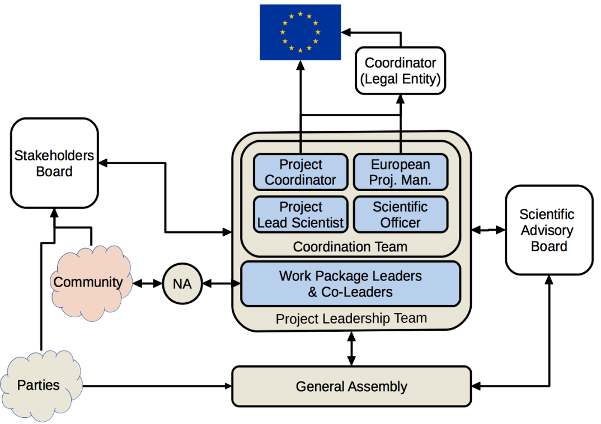

The main objective of this work package (WP) is to ensure an effective, smooth and high-quality implementation of the project, with respect to both general administrative and management practices that are expected for projects funded via the EC programmes, and with respect to financial management.

The coordination work package is under the responsibility of the Coordinator assisted by the European Project Manager.

The following entities deliver the requisite management for the Consortium:

- The Parties are the contractors who form the Consortium

- The Coordinator will be the legal entity acting as the intermediary between the Parties and the European Commission. The Coordinator will, in addition to its responsibilities as a Party, perform the tasks assigned to it as it is described in the Grant Agreement and the Consortium Agreement.

- The Coordination Team will be responsible for ensuring that the Coordinator can deliver on its responsibilities. It consists of:
  - a. The Project Coordinator – who is ultimately responsible to the Coordinator for the project delivery.
  - b. The Project Lead Scientist – who provides additional scientific and technical leadership with a particular focus on technical futures and sustainability.
  - c. The Scientific Officer – who will support the Project Leader and the Project scientist in strategic tasks including the key liaison roles required with other projects and consortia and national and international bodies.
  - d. The European Project Manager – who will aid the Coordinator and Project Leader in delivering their coordination responsibilities.
- The Project Leadership Team (PLT) – consists of the work package leaders, their co-leads and the coordination team. The Work Package Leaders are responsible for the activities within their work packages, including their deliverables and the project milestones.
- The Stakeholders Board consists of representatives of the key users and providers of the IS-ENES infrastructure, including the major modelling groups and representatives of large funded science projects.
- The Science Advisory Board consists of independent external experts who can provide scientific advice and reflection from an alternative perspective.
- The General Assembly consisting of a representative of each of the Parties, will be the ultimate decision making body of the Consortium.
